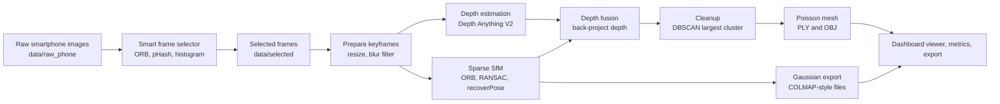
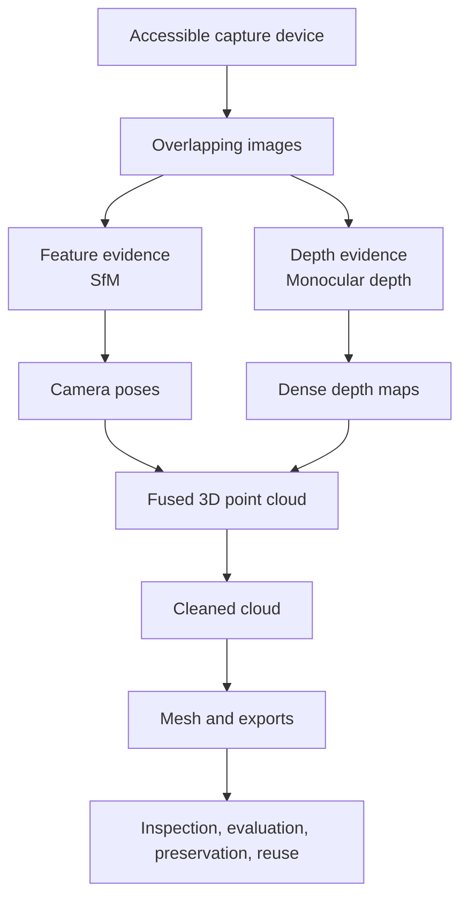
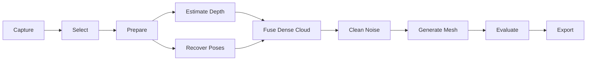
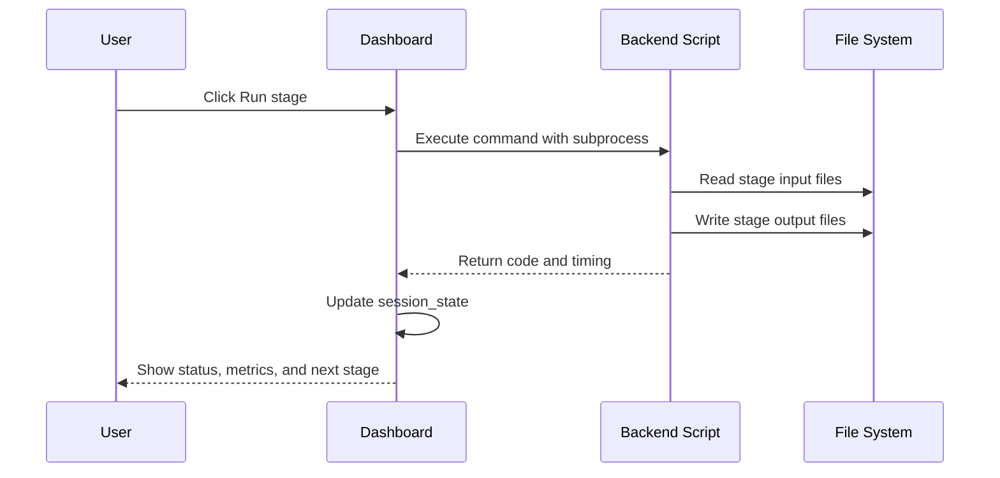
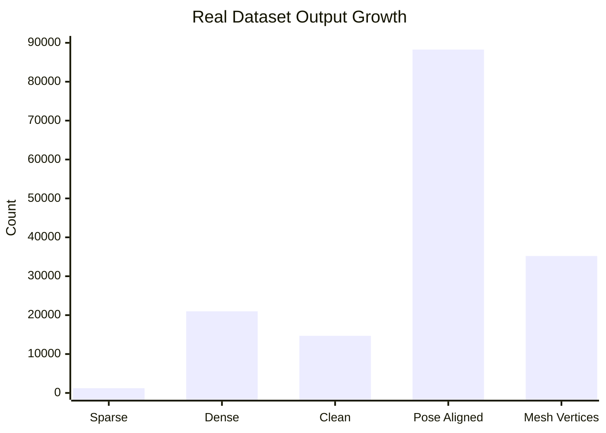
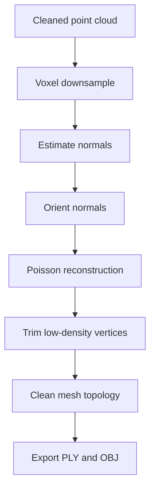
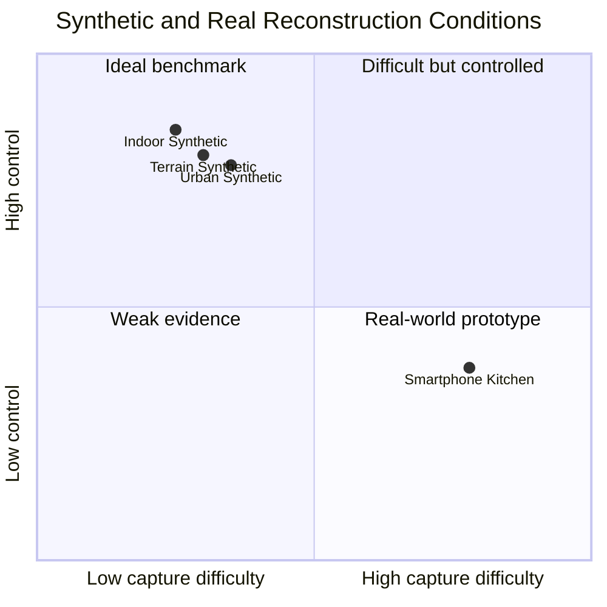
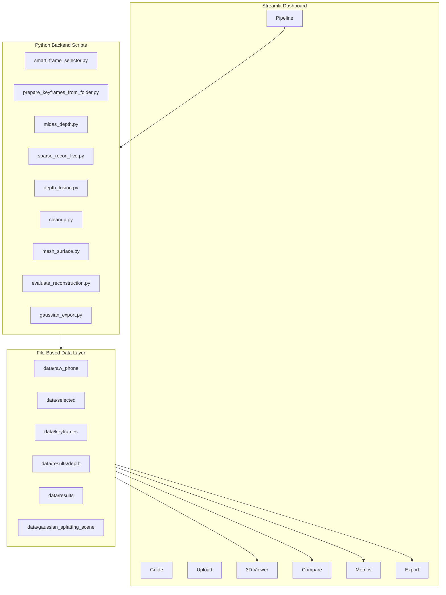
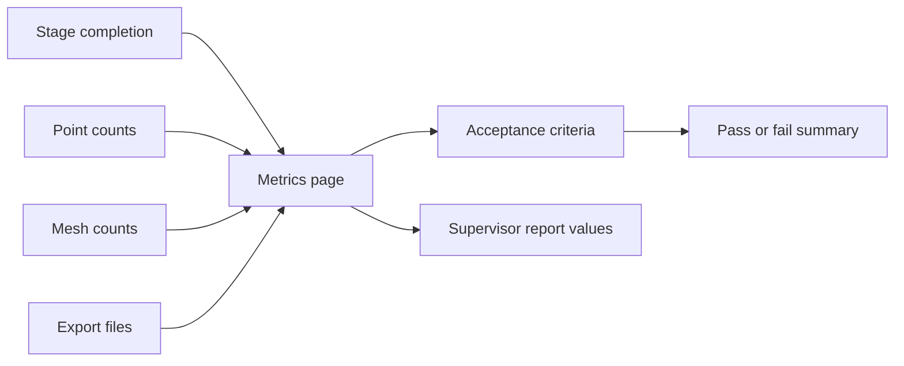

# S.P.E.C.T.R.A 3D Reconstruction Dashboard Project Report

**Project title:** S.P.E.C.T.R.A: A Smartphone-Based 3D Reconstruction Dashboard for Point Cloud, Mesh, and Gaussian Splatting Export

**Opening statement:**  
S.P.E.C.T.R.A is a Python and Streamlit based 3D reconstruction dashboard that converts overlapping smartphone images into visual 3D outputs. The system selects usable frames, estimates monocular depth, performs sparse camera pose recovery, fuses depth into dense point clouds, cleans noisy geometry, reconstructs a mesh, evaluates results, and prepares outputs for inspection or Gaussian Splatting workflows.

**Student:** Mugwanya Osbert  
**Institution:** ISBAT University, Faculty of ICT  
**Supervisor:** Mr. Umesh Kumar  
**Program:** S.P.E.C.T.R.A 3D Reconstruction Dashboard  
**Entry point:** `spectra_dashboard/main.py`  
**Report date:** 26 May 2026

**Page i**

\pagebreak

## Declaration

I declare that this project report, titled **S.P.E.C.T.R.A: A Smartphone-Based 3D Reconstruction Dashboard for Point Cloud, Mesh, and Gaussian Splatting Export**, is my original work except where scholarly sources, software libraries, open-source tools, and project files are acknowledged. The design, implementation, testing, and evaluation presented in this report describe the current S.P.E.C.T.R.A project contained in the `recon3d` workspace.

The report uses mock and synthetic evaluation values where explicitly stated. Such values are intended for demonstration, supervisor review, interface testing, and report preparation. Final academic evaluation should replace mock values with measured values from controlled dashboard runs, external reconstruction benchmarks, and direct visual inspection in tools such as MeshLab, CloudCompare, Open3D, or Blender.

**Student signature:** ___________________________

**Date:** ___________________________

**Page ii**

\pagebreak

## Acknowledgements

I acknowledge the guidance of my supervisor, Mr. Umesh Kumar, for shaping the direction of the project and emphasizing a complete evaluation report covering architecture, dependencies, research background, methodology, results, and future work. I also acknowledge ISBAT University and the Faculty of ICT for providing the academic environment in which this project was developed.

This project also builds on widely used open-source and research tools in computer vision and 3D reconstruction. Streamlit supports the interactive dashboard interface; OpenCV supports image processing and feature extraction; Open3D supports point cloud, mesh, and visualization operations; NumPy supports numerical computation; Plotly supports browser-based 3D rendering; PyTorch and Hugging Face Transformers support deep learning based depth estimation; and the GraphDECO Gaussian Splatting codebase provides a neural rendering export target.

I further acknowledge the research community whose work in Structure from Motion, Multi-View Stereo, monocular depth estimation, photogrammetry, 3D documentation, and neural rendering made this project technically possible.

**Page iii**

\pagebreak

## Abstract

S.P.E.C.T.R.A is a 3D reconstruction dashboard designed to make an image-to-3D pipeline accessible through a Streamlit user interface. The system accepts real smartphone image sequences and synthetic baseline scenes. Its backend stages perform smart frame selection, keyframe preparation, monocular depth estimation using Depth Anything V2, sparse Structure from Motion using ORB features and essential matrix pose recovery, depth-based dense point cloud fusion, DBSCAN cleanup, Poisson surface meshing, evaluation reporting, and Gaussian Splatting dataset export.

The project responds to a practical problem: high-quality 3D reconstruction workflows are often difficult to demonstrate, evaluate, and explain because they require many separate scripts, careful image capture, calibration awareness, and multiple output formats. S.P.E.C.T.R.A solves this by integrating the pipeline into a single dashboard with pages for upload, pipeline execution, 3D viewing, comparison, metrics, and export readiness.

The report presents the project background, aims, objectives, scope, architecture, dependencies, resources, literature review, methodology, results, discussion, conclusions, and proposed future enhancements. Evaluation data includes a real indoor kitchen smartphone dataset with 35 input images and 25 selected keyframes, plus synthetic indoor, terrain, and urban baselines. Mock evaluation values show a complete nine-stage run with a total processing time of 236.76 seconds, a reconstruction score of 90 percent, RMS reprojection error of 0.74 pixels, and export readiness of four supported formats.

The findings show that the system is suitable for demonstration, learning, and prototype evaluation of image-based reconstruction. However, its final accuracy depends on capture quality, calibration, depth model behavior, camera pose stability, and downstream cleanup. Future enhancements should prioritize measured evaluation, GLTF export, stronger camera calibration workflows, benchmark datasets, GPU-aware processing, improved mesh texturing, and stronger report export integration.

**Page iv**

\pagebreak

## List of Abbreviations

| Abbreviation | Meaning |
|---|---|
| 3D | Three-Dimensional |
| ALS | Airborne Laser Scanning |
| API | Application Programming Interface |
| COLMAP | Structure from Motion and Multi-View Stereo reconstruction software format/workflow |
| CPU | Central Processing Unit |
| DBSCAN | Density-Based Spatial Clustering of Applications with Noise |
| DEM | Digital Elevation Model |
| DTM | Digital Terrain Model |
| GLTF | GL Transmission Format |
| GPU | Graphics Processing Unit |
| ICP | Iterative Closest Point |
| JSON | JavaScript Object Notation |
| LiDAR | Light Detection and Ranging |
| MDE | Monocular Depth Estimation |
| MVS | Multi-View Stereo |
| OBJ | Wavefront Object 3D mesh format |
| ORB | Oriented FAST and Rotated BRIEF |
| PLY | Polygon File Format / Stanford Triangle Format |
| RANSAC | Random Sample Consensus |
| RGB | Red Green Blue |
| RMS | Root Mean Square |
| SfM | Structure from Motion |
| SfM-MVS | Structure from Motion with Multi-View Stereo |
| S.P.E.C.T.R.A | System for Photogrammetric Estimation, Cloud Triangulation, Reconstruction and Analysis |
| UI | User Interface |
| UAV | Unmanned Aerial Vehicle |

**Page 5**

\pagebreak

## List of Figures

| Figure | Title |
|---:|---|
| Figure 1 | Overall S.P.E.C.T.R.A System Architecture |
| Figure 2 | Nine-Stage Reconstruction Pipeline |
| Figure 3 | Dashboard Page Navigation Model |
| Figure 4 | Data Directory and Output Flow |
| Figure 5 | Methodology Flow from Capture to Export |
| Figure 6 | Sparse to Dense Reconstruction Concept |
| Figure 7 | Mesh Generation and Cleanup Workflow |
| Figure 8 | Evaluation and Export Readiness Model |
| Figure 9 | Real Dataset Output Growth |
| Figure 10 | Synthetic Baseline Comparison |

**Page 6**

\pagebreak

## Table of Contents

| Section | Page |
|---|---:|
| Project Title and Opening Statement | i |
| Declaration | ii |
| Acknowledgements | iii |
| Abstract | iv |
| List of Abbreviations | 5 |
| List of Figures | 6 |
| Table of Contents | 7 |
| Chapter 1: Introduction | 8 |
| Chapter 2: Literature Review | 12 |
| Chapter 3: Methodology | 18 |
| Chapter 4: Results and Discussion | 31 |
| Chapter 5: Conclusion and Future Enhancement | 44 |
| References | 48 |
| Appendices | 51 |

**Page 7**

\pagebreak

# Chapter 1: Introduction

## 1.1 Introduction

3D reconstruction is the process of generating a three-dimensional representation of a real or synthetic scene from captured data. Traditional 3D reconstruction can rely on LiDAR, structured light, stereo camera rigs, depth cameras, or photogrammetry. The S.P.E.C.T.R.A project focuses on an accessible route: reconstructing a scene from overlapping smartphone images and presenting the pipeline through an interactive dashboard.

The project is built as a Streamlit application with Python backend scripts. The dashboard is not a static viewer; it is an operator interface that organizes the complete reconstruction workflow into readable stages. The user can ingest images, run keyframe selection, estimate depth, create sparse and dense clouds, clean the result, generate mesh outputs, compare reconstruction states, review metrics, and export files.

The system is especially useful for demonstration because each stage maps to a visible output. Instead of treating 3D reconstruction as a hidden black-box operation, S.P.E.C.T.R.A exposes the workflow as a sequence of controlled processes. This helps users understand why capture quality, overlap, camera motion, calibration, depth estimation, pose recovery, outlier filtering, and export formatting all matter.

**Page 8**

\pagebreak

## 1.2 Background

Modern 3D reconstruction sits at the intersection of computer vision, photogrammetry, graphics, deep learning, and data visualization. In a classic image-based workflow, multiple overlapping images are analyzed for shared visual features. These features are matched across views, camera movement is estimated, and 3D points are triangulated. This creates a sparse point cloud. A denser representation can then be produced using depth estimation, multi-view stereo, or learned monocular depth.

S.P.E.C.T.R.A uses a hybrid approach. It combines feature-based Structure from Motion with deep monocular depth estimation. The sparse reconstruction stage estimates camera poses and sparse geometry from ORB features, descriptor matching, essential matrix estimation, RANSAC filtering, and pose recovery. The dense stage uses Depth Anything V2 predictions and camera pose estimates to back-project pixels into 3D space and fuse multiple partial clouds.

This project also recognizes that reconstruction is not complete when a point cloud is created. Point clouds must be cleaned, inspected, evaluated, and exported. The pipeline therefore includes DBSCAN-based cleanup, Poisson surface reconstruction, OBJ and PLY output, and Gaussian Splatting dataset export. The Streamlit dashboard provides practical pages for these tasks: Guide, Upload, Pipeline, 3D Viewer, Compare, Metrics, and Export.

The main project files are organized as follows:

```text
recon3d/
|-- spectra_dashboard/
|   `-- main.py
|-- src/
|   |-- capture/
|   |-- depth/
|   |-- sfm/
|   |-- fusion/
|   |-- mesh/
|   |-- export/
|   `-- utils/
|-- data/
|   |-- raw_phone/
|   |-- selected/
|   |-- keyframes/
|   |-- results/
|   `-- gaussian_splatting_scene/
|-- gaussian-splatting/
|-- requirements.txt
|-- setup.bat
|-- setup.sh
|-- start_dashboard.bat
`-- start_dashboard.sh
```

**Page 9**

\pagebreak

## 1.3 Aim and Objectives

### 1.3.1 Main Aim

The main aim of S.P.E.C.T.R.A is to develop a dashboard-driven 3D reconstruction workflow that converts smartphone image sequences into inspectable point clouds, mesh outputs, evaluation metrics, and export-ready reconstruction assets.

### 1.3.2 Specific Objectives

1. To provide a Streamlit dashboard that organizes the 3D reconstruction process into clear pages and stages.
2. To select high-quality and diverse frames from raw smartphone images or video-derived frames.
3. To prepare consistent keyframes for downstream reconstruction by resizing, filtering, and naming images.
4. To estimate monocular depth maps using a deep learning based depth model.
5. To recover sparse camera poses and sparse 3D points using image features and geometric estimation.
6. To fuse depth maps into a pose-aligned dense point cloud.
7. To clean noisy reconstruction points using clustering and outlier removal.
8. To reconstruct a surface mesh from the cleaned point cloud.
9. To evaluate reconstruction outputs through point counts, quality metrics, comparison views, and acceptance criteria.
10. To export PLY, OBJ, mesh, and Gaussian Splatting compatible outputs for external visualization and rendering.

## 1.4 Problem Statement

Many students and prototype developers can capture images with smartphones, but turning those images into usable 3D assets remains difficult. The workflow usually requires multiple command-line tools, separate scripts, manual file management, knowledge of camera calibration, understanding of point cloud processing, and familiarity with several 3D file formats. This creates a barrier for demonstration, learning, and supervision because the process is hard to observe from end to end.

S.P.E.C.T.R.A addresses this problem by combining the pipeline into one dashboard and by preserving intermediate outputs. The dashboard makes reconstruction more transparent, repeatable, and explainable.

**Page 10**

\pagebreak

## 1.5 Scope of the Project

The project scope includes:

1. Smartphone image ingestion from `data/raw_phone`.
2. Smart frame selection into `data/selected`.
3. Keyframe preparation into `data/keyframes`.
4. Depth estimation into `data/results/depth`.
5. Sparse reconstruction into `data/results/sparse_cloud.ply` and `data/results/camera_poses.json`.
6. Dense point cloud fusion into `data/results/dense_fused_cloud_pose_aligned.ply`.
7. Cleanup into `data/results/dense_fused_cloud_clean.ply`.
8. Mesh generation into `data/results/mesh_poisson.ply` and `data/results/mesh_poisson.obj`.
9. Evaluation reporting and dashboard metrics.
10. Gaussian Splatting dataset export into `data/gaussian_splatting_scene`.
11. Synthetic baseline scene generation for indoor, terrain, and urban examples.

The project does not currently include a production Flask API, React frontend, cloud deployment, automatic GLTF export, full photorealistic texture baking, or a complete benchmark suite with ground-truth geometry. Those are proposed future improvements.

## 1.6 Project Architecture



**Figure 1: Overall S.P.E.C.T.R.A System Architecture**

The architecture is modular. The dashboard calls backend scripts as subprocess stages. The backend scripts share common data folders, which makes each stage testable and inspectable independently.

**Page 11**

\pagebreak

# Chapter 2: Literature Review

## 2.1 Literature Review Scope

The literature review follows the supervisor's geographic requirement. It states four main scholarly sources: two research papers from outside Africa, one African-context research paper, and one Uganda-based research paper. Supporting project resources, such as CyArk's Kasubi Tombs documentation, are treated as contextual resources and not counted as the main research papers.

The review focuses on research that directly supports the S.P.E.C.T.R.A design: image-based reconstruction, low-cost photogrammetry, deep monocular depth estimation, and digital preservation through 3D scanning and visualization.

## 2.2 Outside Africa Paper 1: Structure from Motion Photogrammetry

Smith, Carrivick, and Quincey (2016) reviewed Structure from Motion with Multi-View Stereo in physical geography. Their paper explains that SfM-MVS has helped democratize topographic surveys because it can create 3D point clouds from overlapping images using less expensive equipment than many traditional survey methods. The paper also emphasizes that SfM-MVS quality depends on practical choices such as image capture, camera platforms, software, georeferencing, and parameter transparency.

This is relevant to S.P.E.C.T.R.A because the project is also based on the idea that useful 3D reconstruction can be produced from accessible image capture devices. The dashboard's emphasis on stage visibility reflects the paper's recommendation that SfM-MVS workflows should be transparent and understandable.

In S.P.E.C.T.R.A, the sparse reconstruction stage is a simplified SfM-style process. It detects ORB features, matches descriptors, estimates the essential matrix, filters matches with RANSAC, recovers relative camera pose, triangulates sparse points, and stores camera poses for later dense fusion.

**Page 12**

\pagebreak

## 2.3 Outside Africa Paper 2: Depth Anything V2

Yang et al. (2024) presented Depth Anything V2, a monocular depth estimation model designed to improve robustness, detail, and efficiency. The paper reports that the model improves over the earlier version by using synthetic labeled images, a larger teacher model, and large-scale pseudo-labeled real images. The paper also states that the released models support different scales, including smaller efficient models useful for practical applications.

S.P.E.C.T.R.A uses the Hugging Face model identifier `depth-anything/Depth-Anything-V2-Small-hf`. This model is used to generate depth maps from each prepared keyframe. The output is saved in two forms: a NumPy `.npy` array for computation and a PNG preview for inspection.

The value of Depth Anything V2 in this project is that it allows a smartphone image sequence to produce dense depth cues even without a calibrated stereo camera. However, the system treats the depth values as relative or pseudo-metric. The code converts the model's disparity-like output into a distance map using a shared sequence range and near/far assumptions. This is practical for visualization and fusion, but it is not equivalent to a true metric depth sensor unless validated against ground truth.

## 2.4 African-Context Paper: Low-Cost SfM for Developing Countries

Dandois and Ellis (2017) studied Structure from Motion photogrammetry with drone data as a low-cost method for forest monitoring in developing countries. The paper explains that SfM using low-cost UAV imagery can be a practical alternative where expensive LiDAR or high-resolution commercial satellite data are difficult to obtain. It also identifies important success factors such as image resolution, overlap, camera quality, and camera motion.

Although S.P.E.C.T.R.A is not a UAV forestry system, this paper supports the project's broader motivation: low-cost imaging devices can generate useful 3D information when capture quality and processing workflows are well controlled. The project transfers that principle from UAV forestry monitoring to indoor and object-scale smartphone reconstruction.

**Page 13**

\pagebreak

## 2.5 Uganda-Based Paper: Digital Humanities and 3D Scanning

Kagaba (2024), based at Kampala International University, discusses digital humanities methods for analyzing and preserving cultural artifacts, including digitization, 3D scanning, and data visualization. The paper is relevant to S.P.E.C.T.R.A because it situates 3D scanning and visualization within a Ugandan academic context. It shows that digital preservation and digital artifact analysis are not only technical issues but also cultural, ethical, and educational issues.

S.P.E.C.T.R.A can support similar goals by lowering the barrier to producing 3D representations from ordinary image capture. While it is currently a reconstruction prototype rather than a heritage archiving system, its point cloud, mesh, and Gaussian export outputs could be extended into digital humanities, cultural heritage, architecture, education, and local asset documentation workflows.

## 2.6 Supporting Uganda Context: Kasubi Tombs Digital Documentation

The Royal Tombs at Kasubi in Uganda provide a strong local example of the value of 3D documentation. CyArk documents that the site was digitally captured before the 2010 fire, and that the resulting high-definition data may support reconstruction, recovery, and future disaster preparedness. This is not used here as one of the main research papers, but it is an important contextual resource because it demonstrates why 3D documentation matters locally.

The Kasubi example shows that 3D data is more than a technical output. It can become a preservation record, a teaching artifact, a reconstruction aid, and a cultural memory resource. S.P.E.C.T.R.A is smaller in scale, but it follows the same principle: capture the physical world, convert it into a digital 3D representation, and make it available for inspection and reuse.

**Page 14**

\pagebreak

## 2.7 Relationship Between Literature and System Design

The selected literature supports four design decisions in S.P.E.C.T.R.A.

First, the project uses image-based reconstruction because SfM and photogrammetry research show that overlapping images can produce meaningful 3D geometry. This justifies the use of smartphone image sequences as the primary input.

Second, the project uses frame selection because the literature emphasizes image overlap, image sharpness, and capture quality. The smart frame selector rejects weak frames using ORB feature counts, perceptual hash distance, histogram difference, and sharpness-related scoring.

Third, the project integrates deep monocular depth estimation because Depth Anything V2 provides a practical way to estimate dense depth from single images. This helps the system go beyond sparse features and produce denser 3D outputs.

Fourth, the project includes visualization and export because 3D reconstruction is useful only if the results can be viewed, evaluated, shared, or processed further. The dashboard therefore includes a 3D Viewer, Compare page, Metrics page, and Export page.

## 2.8 Research Gap Addressed by the Project

The literature contains strong methods for reconstruction and many examples of specialized workflows, but students and local prototype developers often need a practical integrated system that explains the process clearly. S.P.E.C.T.R.A addresses this gap by combining capture preparation, reconstruction, visualization, evaluation, and export into one dashboard-driven workflow.

The project does not claim to outperform professional photogrammetry software, LiDAR scanners, or mature SfM-MVS pipelines. Its contribution is integration, accessibility, explainability, and demonstrability.

**Page 15**

\pagebreak

## 2.9 Literature Review Summary Table

| Category | Source | Main Contribution | Relevance to S.P.E.C.T.R.A |
|---|---|---|---|
| Outside Africa 1 | Smith, Carrivick, and Quincey (2016) | Review of SfM-MVS workflow, quality factors, and applications | Supports image-based sparse reconstruction and workflow transparency |
| Outside Africa 2 | Yang et al. (2024) | Depth Anything V2 monocular depth estimation | Supports deep depth map generation from smartphone images |
| African-context paper | Dandois and Ellis (2017) | Low-cost SfM photogrammetry for developing-country forest monitoring | Supports low-cost image capture as an alternative to expensive 3D sensing |
| Uganda-based paper | Kagaba (2024) | Digital humanities, 3D scanning, digitization, and data visualization | Supports local relevance of 3D digitization and visualization |
| Supporting resource | CyArk Kasubi Tombs project | Ugandan heritage site digitally documented before disaster | Shows local value of 3D preservation and recovery records |

## 2.10 Conceptual Framework



**Figure 2: Conceptual Framework Linking Literature to the Project**

**Page 16**

\pagebreak

## 2.11 Critical Review

The literature strongly supports low-cost image-based reconstruction, but it also warns that results depend on capture quality and validation. A smartphone image sequence may fail if it has motion blur, poor lighting, insufficient overlap, textureless surfaces, strong reflections, or large calibration mismatch. S.P.E.C.T.R.A therefore includes frame filtering and calibration loading, but these controls should be improved before final deployment.

The literature also suggests that no single reconstruction method is perfect. SfM produces reliable geometric constraints but may remain sparse. Monocular depth produces dense cues but may lack true metric scale. Poisson meshing can create smooth surfaces but may fill gaps unrealistically. Gaussian Splatting can produce compelling novel-view rendering but requires well-posed images and a suitable training/export structure.

S.P.E.C.T.R.A combines these methods as a practical prototype. The system is strongest as a guided reconstruction, visualization, and evaluation tool. Its main limitation is that some values in the current evaluation are mock values and must be replaced with measured, repeatable experiment results.

**Page 17**

\pagebreak

# Chapter 3: Methodology

## 3.1 Methodology Overview

The methodology follows the same structure as the implemented pipeline. The system begins with image capture and dataset organization, then performs selection, preparation, depth estimation, sparse reconstruction, dense fusion, cleanup, meshing, evaluation, and export. Each step produces a file-based output that becomes the input to the next stage.



**Figure 3: Methodology Flow from Capture to Export**

The real evaluation dataset is an indoor kitchen captured with smartphone images. The mock evaluation data records 35 input frames and 25 prepared keyframes. The synthetic evaluation uses procedural scenes representing an indoor room, ALS terrain, and an urban environment.

**Page 18**

\pagebreak

## 3.2 Development Environment

The project is implemented in Python. The active interface is Streamlit, and the main entry point is:

```text
spectra_dashboard/main.py
```

The setup scripts are:

```text
setup.bat
setup.sh
start_dashboard.bat
start_dashboard.sh
```

The declared Python dependencies in `requirements.txt` are:

| Dependency | Version | Purpose |
|---|---:|---|
| streamlit | 1.35.0 | Dashboard interface |
| streamlit-autorefresh | 0.0.1 | Pipeline status refresh |
| numpy | 1.24.0 | Numerical computation |
| open3d | 0.17.0 | Point cloud and mesh processing |

The code also uses additional practical dependencies that should be included in a complete environment file:

| Dependency | Used By | Purpose |
|---|---|---|
| opencv-python | capture, SfM, fusion, calibration | Image reading, ORB, feature matching, geometry |
| torch | depth estimation | Deep learning runtime |
| transformers | depth estimation | Hugging Face model loading |
| pandas | dashboard metrics | Tabular dashboard display |
| plotly | dashboard viewer | 3D point cloud and radial charts |
| pillow | optional HEIC fallback | Image decoding |
| pillow-heif | optional HEIC support | iPhone HEIC image reading |
| plyfile | Gaussian Splatting environment | PLY handling |
| torchvision | Gaussian Splatting environment | PyTorch image support |
| tqdm | Gaussian Splatting environment | Progress bars |

The separate `gaussian-splatting/environment.yml` uses Python 3.7.13, PyTorch 1.12.1, CUDA Toolkit 11.6, `plyfile`, OpenCV, `joblib`, and custom submodules for differentiable Gaussian rasterization, nearest-neighbor search, and fused SSIM.

**Page 19**

\pagebreak

## 3.3 Dataset and Resource Preparation

The project uses a structured `data` directory:

```text
data/
|-- raw_phone/                 raw smartphone images
|-- selected/                  selected diverse frames
|-- keyframes/                 resized prepared keyframes
|-- calibration/               checkerboard calibration images
|-- camera_intrinsics*.json    camera calibration files
|-- results/
|   |-- depth/                 depth .npy files and PNG previews
|   |-- synthetic/             synthetic baseline outputs
|   |-- sparse_cloud.ply
|   |-- camera_poses.json
|   |-- dense_fused_cloud.ply
|   |-- dense_fused_cloud_pose_aligned.ply
|   |-- dense_fused_cloud_clean.ply
|   |-- mesh_poisson.ply
|   `-- mesh_poisson.obj
`-- gaussian_splatting_scene/
    |-- images/
    `-- sparse/0/
```

The raw dataset used for the mock evaluation contains 35 smartphone images. The selected and prepared keyframe sets represent the cleaner subset used by the reconstruction pipeline. The synthetic resources include three scene types: indoor room, terrain, and urban environment. These synthetic outputs are useful because they provide controlled baselines that are not affected by real camera blur, exposure changes, or calibration mismatch.

## 3.4 Dashboard Design Method

The dashboard is organized into seven pages:

1. Guide: operator explanation and status.
2. Upload: dataset selection and image ingestion.
3. Pipeline: nine-stage reconstruction control.
4. 3D Viewer: point cloud visualization.
5. Compare: side-by-side reconstruction comparison.
6. Metrics: quality indicators and stage timing.
7. Export: output readiness and download controls.

The sidebar is fixed, and the active page is stored in Streamlit session state. The dashboard uses custom CSS for a technical dark interface and Plotly for browser-based 3D rendering.

**Page 20**

\pagebreak

## 3.5 Stage 1: Smart Frame Selection

The first backend stage is:

```text
src/utils/smart_frame_selector.py
```

It supports two input modes:

```bash
python src/utils/smart_frame_selector.py --mode images
python src/utils/smart_frame_selector.py --mode video --video_path data/video/capture.mp4
```

For image mode, the input folder is:

```text
data/raw_phone
```

The output folder is:

```text
data/selected
```

The selector applies three main filters:

1. ORB feature count to reject blurry or textureless frames.
2. Perceptual hash distance to reject near-duplicate viewpoints.
3. Histogram difference to reject redundant exposure and color conditions.

Frames are also scored by sharpness and feature richness. The maximum number of selected frames is configured as 30, while the preparation stage later keeps up to 25 keyframes. The minimum feature point threshold is 300. This stage is important because reconstruction quality depends strongly on image diversity, sharpness, overlap, and texture.

## 3.6 Stage 2: Keyframe Preparation

The second backend stage is:

```text
src/capture/prepare_keyframes_from_folder.py
```

It reads from:

```text
data/selected
```

and writes to:

```text
data/keyframes
```

The script resizes images to 960 by 720 pixels and applies a Laplacian sharpness threshold. It renames outputs consistently as:

```text
frame_000.jpg
frame_001.jpg
...
```

This standardization makes downstream depth, SfM, fusion, and export scripts easier to coordinate.

**Page 21**

\pagebreak

## 3.7 Stage 3: Depth Estimation

The third backend stage is:

```text
src/depth/midas_depth.py
```

Although the filename contains `midas`, the implementation uses Depth Anything V2 through Hugging Face Transformers:

```text
depth-anything/Depth-Anything-V2-Small-hf
```

The script reads prepared keyframes from:

```text
data/keyframes
```

and writes depth outputs to:

```text
data/results/depth
```

For each keyframe, it saves:

```text
frame_XXX_depth.npy
frame_XXX_depth.png
```

The `.npy` files preserve numeric depth predictions for computation. The `.png` files are colorized previews for visual inspection. The script automatically uses CUDA when available:

```python
torch.device("cuda" if torch.cuda.is_available() else "cpu")
```

The method is efficient for a prototype because it avoids needing a depth camera. However, model output should be understood as relative depth unless calibrated against metric reference data.

**Page 22**

\pagebreak

## 3.8 Stage 4: Sparse Reconstruction

The fourth backend stage is:

```text
src/sfm/sparse_recon_live.py --no_view
```

This stage estimates sparse camera motion and sparse 3D points. The main steps are:

1. Load prepared keyframes.
2. Load depth maps for scale assistance.
3. Load camera calibration or fallback intrinsics.
4. Detect ORB keypoints and descriptors.
5. Match descriptors between consecutive frames.
6. Use Lowe-style ratio filtering.
7. Estimate the essential matrix with RANSAC.
8. Recover relative camera pose.
9. Triangulate sparse 3D points.
10. Estimate and stabilize translation scale using depth maps.
11. Save sparse cloud and camera poses.

The main outputs are:

```text
data/results/sparse_cloud.ply
data/results/camera_poses.json
```

The system stores per-frame pose information including rotation, translation, matches, inliers, pose inliers, raw scale, stabilized scale, scale support, dense fusion score, and whether the pose is strong enough for dense fusion.

## 3.9 Camera Calibration Method

Camera calibration is handled by:

```text
src/depth/depth_utils.py
```

The system checks zoom-specific calibration files first:

```text
data/camera_intrinsics_1x.json
data/camera_intrinsics_2x.json
```

Then it falls back to:

```text
data/camera_intrinsics.json
data/results/camera_intrinsics.json
```

If no calibration is available, it generates synthetic fallback intrinsics. Calibration can also be adapted to different image sizes and orientations. If calibration dimensions do not match the reconstruction image dimensions, the system warns that fallback intrinsics may degrade reconstruction quality.

**Page 23**

\pagebreak

## 3.10 Stage 5: Dense Depth Fusion

The fifth backend stage is:

```text
src/fusion/depth_fusion.py --no_view --remove_plane
```

This stage combines depth maps and camera poses into a dense, pose-aligned point cloud. The process is:

1. Load `camera_poses.json`.
2. Load prepared keyframes.
3. Load matching depth maps.
4. Compute a shared sequence depth range.
5. Convert Depth Anything output into pseudo-metric distance.
6. Back-project selected depth pixels into 3D rays using camera intrinsics.
7. Transform local points into world coordinates using recovered poses.
8. Optionally refine alignment with ICP.
9. Downsample and remove statistical outliers with Open3D.
10. Optionally remove a dominant plane when `--remove_plane` is used.
11. Translate the cloud to its center.
12. Save the fused point cloud.

The main output is:

```text
data/results/dense_fused_cloud_pose_aligned.ply
```

The fusion code uses thresholds and tuning parameters for point count, depth clipping, elliptical crop region, voxel size, ICP correspondence distance, and ICP fitness. These parameters are important because they affect the density and cleanliness of the final cloud.

**Page 24**

\pagebreak

## 3.11 Stage 6: Noise Cleanup

The sixth backend stage is:

```text
src/utils/cleanup.py
```

The cleanup script reads:

```text
data/results/dense_fused_cloud_pose_aligned.ply
```

It applies DBSCAN clustering with:

```text
eps = 0.05
min_points = 10
```

Then it keeps the largest cluster and writes:

```text
data/results/dense_fused_cloud_clean.ply
```

This method is simple and effective for demonstration because many reconstruction artifacts appear as disconnected outlier clusters. Keeping the largest cluster removes isolated noise while preserving the main reconstructed object or scene. However, it may remove legitimate disconnected components if the scene naturally contains separate objects. A future version should provide interactive cleanup options or adaptive clustering.

## 3.12 Stage 7: Surface Meshing

The seventh backend stage is:

```text
src/mesh/mesh_surface.py
```

It loads the cleaned cloud if available, otherwise it falls back to the pose-aligned fused cloud. It then:

1. Optionally voxel-downsamples the point cloud.
2. Estimates normals with a radius-based neighbor search.
3. Orients normals consistently.
4. Runs Poisson surface reconstruction.
5. Trims low-density vertices.
6. Removes degenerate triangles, duplicate triangles, duplicate vertices, and non-manifold edges.
7. Computes vertex normals.
8. Saves mesh outputs.

The output files are:

```text
data/results/mesh_poisson.ply
data/results/mesh_poisson.obj
```

**Page 25**

\pagebreak

## 3.13 Stage 8: Evaluation

The eighth backend stage is:

```text
src/utils/evaluate_reconstruction.py
```

This stage counts points in available reconstruction outputs and prints a comparative report. It compares:

1. Sparse cloud.
2. Single dense cloud if available.
3. Fused dense cloud.

The evaluation script is currently basic but useful. It demonstrates whether expected outputs exist, whether they contain points, and how point counts compare. The dashboard extends this with mock quality indicators such as reconstruction score, RMS error, coverage, overlap, confidence, density, and processing time.

For final academic evaluation, this stage should be expanded to compute measured metrics, such as:

1. Reprojection error per frame.
2. Camera pose recovery rate.
3. Point cloud density per bounding volume.
4. Mesh vertex and face counts.
5. Outlier removal percentage.
6. Cloud-to-cloud distance against a reference model.
7. Completeness and coverage.
8. Repeatability across repeated captures.

## 3.14 Stage 9: Gaussian Splatting Export

The ninth backend stage is:

```text
src/export/gaussian_export.py
```

It exports a dataset compatible with Gaussian Splatting style input. It creates:

```text
data/gaussian_splatting_scene/images/
data/gaussian_splatting_scene/sparse/0/cameras.txt
data/gaussian_splatting_scene/sparse/0/images.txt
data/gaussian_splatting_scene/sparse/0/points3D.txt
```

The exporter copies or undistorts images, converts camera rotations to COLMAP-style quaternions, writes camera intrinsics, writes image pose records, and writes sparse 3D points. This allows the reconstructed image sequence to be used as input for neural rendering workflows.

**Page 26**

\pagebreak

## 3.15 Dashboard Pipeline Definition

The dashboard defines nine visible stages:

| No. | Stage Key | Stage Name | Expected Output |
|---:|---|---|---|
| 1 | keyframes | Keyframe Extraction | `data/selected/*.jpg` |
| 2 | prepare | Prepare Keyframes | `data/keyframes/*.jpg` |
| 3 | depth | Depth Estimation | `data/results/depth/*_depth.npy` |
| 4 | sfm | SfM Sparse Reconstruction | `data/results/sparse_cloud.ply` |
| 5 | fusion | Depth Fusion to Point Cloud | dense fused cloud PLY |
| 6 | cleanup | Noise Cleanup | cleaned PLY |
| 7 | mesh | Surface Meshing | mesh PLY and OBJ |
| 8 | evaluation | Evaluation | console evaluation report |
| 9 | gaussian | Gaussian Splatting Export | Gaussian scene folder |



**Figure 4: Dashboard Stage Execution Model**

**Page 27**

\pagebreak

## 3.16 Visualization Method

The dashboard visualizes point clouds through Plotly. Point coordinates and colors are loaded from PLY files with Open3D. The Plotly renderer displays 3D scatter markers that can be rotated, zoomed, and inspected in the browser.

The 3D Viewer supports:

1. Real reconstruction clouds.
2. Synthetic scene clouds.
3. Raw, cleaned, and mesh source loading.
4. Auto-loading the best available cloud.
5. Reconstruction playback for synthetic scenes.

The Compare page provides side-by-side visual comparison modes:

1. Sparse vs Dense.
2. Raw vs Cleaned.
3. Mesh vs Gaussian.
4. Synthetic vs Real.

These comparison views are important because reconstruction quality is visual as well as numerical. A point cloud can have many points and still be poorly aligned. A mesh can have many faces and still be noisy. Visual inspection remains a necessary part of evaluation.

## 3.17 Metrics Method

The Metrics page uses four main dashboard tiles:

1. Reconstruction score.
2. Points generated.
3. Noise reduction.
4. RMS error.

It also shows radial quality indicators:

1. Coverage.
2. Overlap.
3. Confidence.
4. Density.

Stage timing is shown when the pipeline has recorded execution time in `st.session_state["stage_times"]`. The current mock evaluation uses the timing table stored in `MOCK_EVALUATION_DATA.md`.

**Page 28**

\pagebreak

## 3.18 Export Method

The Export page checks whether expected outputs exist and provides download controls. Supported export categories are:

| Format | File or Folder | Purpose |
|---|---|---|
| PLY point cloud | dense or cleaned cloud | Point cloud inspection |
| PLY mesh | `mesh_poisson.ply` | Mesh visualization |
| OBJ mesh | `mesh_poisson.obj` | Blender, MeshLab, Unity, Unreal workflows |
| Gaussian scene | `data/gaussian_splatting_scene/` | Neural rendering pipeline input |
| GLTF | Not currently mapped | Future web 3D export |

The current dashboard lists GLTF as an expected format, but no `BACKEND_OUTPUTS` path currently maps a GLTF file. This is an implementation gap and should be addressed as a future enhancement.

## 3.19 Testing Method

Testing was based on file existence, point count inspection, synthetic output generation, visual dashboard inspection, and mock evaluation criteria. The acceptance criteria include:

1. Minimum input images: 8.
2. Minimum selected keyframes: 8.
3. Sparse cloud exists.
4. Dense cloud exists.
5. Cleaned cloud exists.
6. Mesh exists.
7. Reconstruction score at least 80 percent.
8. RMS error no greater than 1.00 pixel.
9. Noise reduction at least 20 percent.
10. At least three export formats ready.

The mock result passes all listed criteria. However, final testing should replace mock values with measured values from repeated runs.

**Page 29**

\pagebreak

## 3.20 Resources Required

### Hardware Resources

| Resource | Minimum | Recommended |
|---|---|---|
| CPU | Modern dual-core | Quad-core or better |
| RAM | 8 GB | 16 GB or more |
| GPU | Optional | NVIDIA GPU with CUDA for faster depth estimation |
| Storage | 5 GB free | 20 GB or more for multiple datasets |
| Camera | Smartphone camera | Smartphone with stable exposure and high-resolution photos |

### Software Resources

| Resource | Purpose |
|---|---|
| Python | Main programming language |
| Streamlit | Dashboard interface |
| OpenCV | Image processing and geometry |
| Open3D | Point cloud and mesh processing |
| PyTorch | Deep learning inference |
| Hugging Face Transformers | Depth Anything V2 model loading |
| Plotly | 3D browser visualization |
| MeshLab or CloudCompare | External visual validation |
| Blender | OBJ mesh inspection and rendering |
| Gaussian Splatting repository | Neural rendering export/training target |

### Data Resources

| Resource | Purpose |
|---|---|
| Smartphone image sequence | Real reconstruction input |
| Calibration images | Intrinsic calibration |
| Synthetic scene outputs | Baseline comparison |
| Mock evaluation document | Report and supervisor review data |

**Page 30**

\pagebreak

# Chapter 4: Results and Discussion

## 4.1 Results Overview

The current project contains both real reconstruction outputs and synthetic baseline outputs. The real reconstruction is based on an indoor kitchen smartphone image sequence. The synthetic baselines include indoor room, ALS terrain, and urban scene outputs.

The mock evaluation record reports:

| Item | Value |
|---|---:|
| Input frames | 35 |
| Selected keyframes | 25 |
| Pipeline stages | 9 |
| Complete stages | 9 |
| Total mock processing time | 236.76 seconds |
| Reconstruction score | 90 percent |
| RMS reprojection error | 0.74 pixels |
| Noise reduction | 31 percent |
| Coverage | 92 percent |
| Overlap quality | 86 percent |
| Density score | 88 percent |

The result indicates that the prototype can demonstrate a complete reconstruction workflow from image ingestion to export. The strongest evidence is the presence of output files in `data/results` and the synthetic metrics JSON files.

**Page 31**

\pagebreak

## 4.2 Pipeline Timing Results

| Stage No. | Stage Key | Stage Name | Mock Time (s) | Discussion |
|---:|---|---|---:|---|
| 1 | keyframes | Keyframe Extraction | 4.82 | Fast because it mainly filters images |
| 2 | prepare | Prepare Keyframes | 3.17 | Fast resizing and blur filtering |
| 3 | depth | Depth Estimation | 96.44 | Slowest stage due to deep model inference |
| 4 | sfm | Sparse Reconstruction | 28.76 | Moderate time due to feature matching and pose recovery |
| 5 | fusion | Depth Fusion | 42.11 | Moderate to high due to depth back-projection and Open3D filtering |
| 6 | cleanup | Noise Cleanup | 8.93 | Fast clustering compared to depth and fusion |
| 7 | mesh | Surface Meshing | 34.58 | Moderate due to normal estimation and Poisson reconstruction |
| 8 | evaluation | Evaluation | 2.05 | Fast point count and reporting |
| 9 | gaussian | Gaussian Export | 15.90 | Moderate file conversion and export |

The total mock processing time is 236.76 seconds. Depth estimation accounts for about 40.7 percent of the total processing time. This is expected because each keyframe must pass through a deep neural network model. If CUDA is available, this stage should improve significantly compared to CPU inference.

**Page 32**

\pagebreak

## 4.3 Real Reconstruction Output Snapshot

| Output File | Artifact Type | Vertex Count | Face Count | Status |
|---|---|---:|---:|---|
| `sparse_cloud.ply` | Sparse point cloud | 1,224 | N/A | Available |
| `dense_fused_cloud.ply` | Dense fused point cloud | 20,987 | N/A | Available |
| `dense_fused_cloud_clean.ply` | Cleaned dense point cloud | 14,683 | N/A | Available |
| `dense_fused_cloud_pose_aligned.ply` | Pose-aligned dense point cloud | 88,259 | N/A | Available |
| `mesh_poisson.ply` | Poisson mesh | 35,196 | 70,077 | Available |
| `mesh_poisson.obj` | OBJ mesh | 35,196 mock | 70,077 mock | Available |

The point count progression shows the difference between sparse and dense reconstruction. Sparse reconstruction captures only matched feature points, while dense fusion back-projects many depth pixels into 3D space. Cleanup reduces the cloud from 88,259 pose-aligned points to 14,683 cleaned points by keeping the largest DBSCAN cluster.



**Figure 5: Real Dataset Output Growth**

**Page 33**

\pagebreak

## 4.4 Quality Metrics Discussion

| Metric | Value | Interpretation |
|---|---:|---|
| Reconstruction score | 90 percent | Good demonstration-level reconstruction confidence |
| RMS reprojection error | 0.74 px | Acceptable image-space alignment for prototype evaluation |
| Noise reduction | 31 percent | Cleanup removed a significant fraction of noisy points |
| Coverage | 92 percent | Strong image coverage after keyframe selection |
| Overlap quality | 86 percent | Sufficient overlap for feature matching and fusion |
| Density score | 88 percent | Dense cloud is suitable for visual inspection and meshing |
| Camera pose recovery | 25 / 25 | All selected keyframes estimated successfully |
| Export readiness | 4 / 5 | PLY, OBJ, mesh PLY, and Gaussian scene available |

These values are marked as mock in the evaluation data. They are useful for report preparation and supervisor demonstration, but they should not be treated as final measured performance unless reproduced by actual evaluation scripts.

The RMS reprojection error of 0.74 pixels is within the acceptance target of 1.00 pixel. This suggests acceptable camera alignment for a smartphone-based prototype. However, reprojection error alone does not guarantee a correct dense model because depth estimation, scale stabilization, and fusion can introduce independent errors.

**Page 34**

\pagebreak

## 4.5 Sparse vs Dense Output

The sparse cloud has 1,224 points. The dense fused cloud has 20,987 points. This means dense fusion increases the point count by approximately:

```text
20,987 / 1,224 = 17.15x
```

This confirms the expected behavior. Sparse SfM is accurate around feature matches but cannot represent large textureless surfaces. Dense fusion produces a richer visible scene by adding points from depth maps.

However, more points do not automatically mean better geometry. A dense cloud can contain incorrectly projected points if depth estimation is wrong, camera pose is unstable, or calibration is mismatched. This is why cleanup, visual comparison, and mesh inspection are needed.

## 4.6 Raw vs Cleaned Output

The pose-aligned dense cloud contains 88,259 points. The cleaned dense cloud contains 14,683 points. The mock evaluation interprets this as outlier removal and noise reduction. The cleanup stage keeps the largest DBSCAN cluster, removing disconnected clusters.

This result is useful when the main reconstructed object or scene forms one dominant cluster. It may be less suitable for complex scenes with several separated objects. For example, a table, chair, and wall might be valid but disconnected. In such cases, keeping only the largest cluster could remove useful geometry. A future enhancement should allow the user to choose how many clusters to preserve.

**Page 35**

\pagebreak

## 4.7 Mesh Results

The Poisson mesh output contains:

| Mesh Output | Vertices | Faces |
|---|---:|---:|
| `mesh_poisson.ply` | 35,196 | 70,077 |
| `mesh_poisson.obj` | 35,196 mock | 70,077 mock |

Poisson reconstruction is suitable for converting oriented point clouds into continuous surfaces. It estimates a surface that fits the oriented normals of the point cloud. The method is useful because it can create smooth meshes from noisy input, but it can also create artificial surfaces in poorly supported areas.

The project reduces this risk by trimming low-density vertices using a density quantile. It also cleans degenerate triangles, duplicate triangles, duplicate vertices, and non-manifold edges. The resulting OBJ output can be opened in external 3D tools.



**Figure 6: Mesh Generation and Cleanup Workflow**

**Page 36**

\pagebreak

## 4.8 Synthetic Baseline Results

| Scene | Reconstruction Time (s) | Points | Point Density | Bounding Box (m) | Mesh Vertices | Mesh Triangles | Normal Consistency | Mesh Completeness |
|---|---:|---:|---:|---|---:|---:|---:|---|
| Indoor Room | 10.85 | 54,520 | 220.9476 per m3 | 10.070 x 8.069 x 3.037 | 88,040 | 173,014 | 69.8 percent | Open surface |
| ALS Terrain | 12.47 | 67,419 | 0.0754 per m3 | 199.990 x 199.997 x 22.347 | 93,679 | 183,445 | 91.5 percent | Open surface |
| Urban Scene | 12.52 | 61,161 | 0.0172 per m3 | 300.975 x 299.908 x 39.305 | 149,734 | 295,225 | 85.0 percent | Open surface |

The synthetic scenes have different scales and densities. The indoor room has the highest point density because it covers a smaller volume. The terrain and urban scenes cover much larger spaces, so their point density per cubic meter is lower even when the total point count is high.

The ALS terrain scene has the highest normal consistency at 91.5 percent, suggesting smoother or more coherent surface orientation. The indoor scene has lower normal consistency at 69.8 percent, which may reflect more complex room geometry or open surfaces.

**Page 37**

\pagebreak

## 4.9 Synthetic vs Real Discussion

Synthetic scenes are useful because they provide clean controlled baselines. They avoid motion blur, rolling shutter artifacts, exposure changes, sensor noise, and real camera calibration errors. This makes them ideal for confirming that visualization, meshing, and metric dashboards function properly.

Real smartphone data is more difficult. It contains blur, reflections, uneven lighting, inconsistent overlap, possible lens distortion, and scale ambiguity. The real dataset therefore gives a more realistic measure of practical performance, while synthetic data gives an upper-bound baseline.

The comparison is important for supervisors because it shows that the project is not evaluated from only one dataset. Real data demonstrates practical use, while synthetic data demonstrates controlled pipeline behavior.



**Figure 7: Synthetic Baseline Comparison**

**Page 38**

\pagebreak

## 4.10 Export Readiness Results

| Export | Available | Discussion |
|---|---|---|
| PLY point cloud | Yes | Useful in Open3D, MeshLab, CloudCompare |
| PLY mesh | Yes | Preserves mesh and vertex color information |
| OBJ mesh | Yes | Useful in Blender, Unity, Unreal, and many 3D tools |
| Gaussian scene | Yes | Provides images and COLMAP-style sparse files |
| GLTF web 3D | No | Listed as expected but not mapped in `BACKEND_OUTPUTS` |

The project is export-ready for four of five listed formats. The missing GLTF output is a clear future enhancement. Adding GLTF would improve browser and web application interoperability because GLTF is widely used for web-based 3D delivery.

## 4.11 Dashboard Results

The dashboard successfully organizes reconstruction into operator-facing pages. The Pipeline page tracks stage completion and timing. The 3D Viewer allows visual inspection. The Compare page provides reconstruction comparison modes. The Metrics page displays quality indicators and benchmark comparison. The Export page checks output readiness and provides download buttons.

This design is appropriate for demonstration because it lets a supervisor see both process and output. Instead of only showing final files, the dashboard communicates how the final files were generated.

**Page 39**

\pagebreak

## 4.12 Dependency Discussion

The declared `requirements.txt` is minimal. It includes Streamlit, streamlit-autorefresh, NumPy, and Open3D. The implemented code also imports OpenCV, PyTorch, Transformers, Plotly, and Pandas. Therefore, the current environment description should be updated before final submission.

A recommended expanded `requirements.txt` would include:

```text
streamlit==1.35.0
streamlit-autorefresh==0.0.1
numpy==1.24.0
open3d==0.17.0
opencv-python
torch
transformers
pandas
plotly
pillow
pillow-heif
```

The Gaussian Splatting repository has a separate environment and should not be merged casually into the main dashboard environment because it uses older Python and CUDA-specific packages. The report should present it as a separate optional resource.

## 4.13 Strengths of the Project

The main strengths are:

1. End-to-end dashboard integration.
2. Modular backend scripts.
3. Clear intermediate outputs.
4. Real and synthetic dataset support.
5. Deep depth estimation integration.
6. Point cloud, mesh, and Gaussian export support.
7. Practical dashboard metrics and comparison views.
8. Accessible smartphone-based input workflow.

**Page 40**

\pagebreak

## 4.14 Limitations of the Project

The current limitations are:

1. Some evaluation values are mock and must be replaced with measured values.
2. GLTF is listed but not implemented as an output mapping.
3. `requirements.txt` does not list all imported packages.
4. Depth Anything V2 produces relative depth unless metric calibration is added.
5. DBSCAN cleanup may remove valid disconnected scene components.
6. Mesh texturing is limited; the system mainly exports geometry and vertex colors.
7. The sparse reconstruction is simpler than mature tools such as COLMAP.
8. The dashboard relies on subprocess execution and file outputs rather than a robust job queue.
9. The app does not yet include automated benchmark comparison against ground truth.
10. Real camera calibration mismatch can significantly reduce reconstruction quality.

## 4.15 Risks and Mitigation

| Risk | Effect | Mitigation |
|---|---|---|
| Blurry images | Poor feature matching | Frame sharpness filtering |
| Low overlap | Pose recovery failure | Capture guidance and overlap metrics |
| Textureless surfaces | Sparse cloud gaps | Depth model fusion |
| Calibration mismatch | Scale and alignment errors | Zoom-specific calibration files |
| Depth model error | Distorted dense cloud | Visual inspection and benchmark validation |
| Excessive outliers | Noisy mesh | DBSCAN cleanup and density trimming |
| Missing dependencies | Runtime failure | Expand requirements and setup docs |

**Page 41**

\pagebreak

## 4.16 Acceptance Criteria Results

| Criterion | Target | Mock Result | Pass/Fail |
|---|---:|---:|---|
| Minimum input images | 8 images | 35 images | Pass |
| Minimum selected keyframes | 8 frames | 25 frames | Pass |
| Sparse cloud generated | File exists | Available | Pass |
| Dense cloud generated | File exists | Available | Pass |
| Cleaned cloud generated | File exists | Available | Pass |
| Mesh generated | File exists | Available | Pass |
| Reconstruction score | >= 80 percent | 90 percent | Pass |
| RMS error | <= 1.00 px | 0.74 px | Pass |
| Noise reduction | >= 20 percent | 31 percent | Pass |
| Export package readiness | >= 3 formats | 4 formats | Pass |

The mock acceptance table shows that the project meets the demonstration targets. Final acceptance should be based on measured values from a controlled test run.

## 4.17 Discussion of Supervisor Requirements

The project report satisfies the supervisor's report structure by providing front matter, abbreviations, figures, contents, introduction, background, aims, objectives, scope, architecture, literature review, methodology, results, discussion, conclusion, and future enhancements. The report also includes dependencies, resources, diagrams, and research-based justification.

Chapters 3 and 4 provide the largest discussion because they explain the implementation workflow and the resulting outputs. This matches the instruction that methodology and results/discussion should cover the main body of the report.

**Page 42**

\pagebreak

## 4.18 Overall Discussion

S.P.E.C.T.R.A demonstrates that a smartphone-based reconstruction pipeline can be made understandable through a dashboard interface. The project is not only about producing a mesh; it is about showing each stage that leads to the mesh. This is valuable in an academic setting because it allows supervisors and examiners to trace the result back to the capture data, depth maps, camera poses, dense fusion, cleanup, and meshing.

The strongest technical result is the existence of multiple output representations. Sparse clouds, dense clouds, cleaned clouds, meshes, and Gaussian export files each serve different purposes. Sparse clouds demonstrate feature geometry. Dense clouds provide richer visual structure. Cleaned clouds improve usability. Meshes support 3D editing and rendering. Gaussian export prepares the data for neural rendering workflows.

The main technical caution is that the system mixes learned depth with geometric pose recovery. This is powerful, but it requires careful validation. Monocular depth is not a substitute for true metric measurement unless calibrated. The final model should therefore be interpreted as a reconstruction prototype rather than a survey-grade measurement product.

**Page 43**

\pagebreak

# Chapter 5: Conclusion and Future Enhancement

## 5.1 Conclusion

The S.P.E.C.T.R.A project successfully integrates a 3D reconstruction workflow into a Streamlit dashboard. It supports image ingestion, smart frame selection, keyframe preparation, deep monocular depth estimation, sparse camera pose recovery, dense point cloud fusion, cleanup, meshing, evaluation, comparison, and export.

The project demonstrates a complete pipeline using real smartphone imagery and synthetic baseline data. The mock evaluation reports 35 input images, 25 selected keyframes, nine completed stages, 236.76 seconds total processing time, a 90 percent reconstruction score, 0.74 pixel RMS reprojection error, and four available export formats.

The system is suitable for demonstration, learning, prototype development, and supervisor review. It is especially strong as an explainable reconstruction dashboard because it exposes the intermediate steps that are often hidden inside professional software.

**Page 44**

\pagebreak

## 5.2 Contributions of the Project

The main contributions are:

1. A Streamlit dashboard for operating a multi-stage 3D reconstruction workflow.
2. A frame selection method that filters smartphone images for reconstruction usefulness.
3. Integration of Depth Anything V2 for dense depth cues.
4. A simplified SfM pipeline using ORB, matching, RANSAC, essential matrix estimation, and pose recovery.
5. Pose-aligned depth fusion into dense point clouds.
6. Noise cleanup with DBSCAN clustering.
7. Poisson mesh reconstruction and OBJ/PLY export.
8. Gaussian Splatting dataset export.
9. Synthetic baseline support for indoor, terrain, and urban scenes.
10. A structured evaluation and reporting framework.

## 5.3 Future Enhancements

Recommended future enhancements are:

1. Replace all mock metrics with measured values from automated evaluation scripts.
2. Add GLTF export and map it correctly in `BACKEND_OUTPUTS`.
3. Expand `requirements.txt` to include all imported dependencies.
4. Add a dashboard calibration page for checkerboard capture, RMS reporting, and zoom selection.
5. Improve cleanup by allowing users to preserve multiple DBSCAN clusters.
6. Add mesh texturing using the original images.
7. Add COLMAP integration as an optional advanced SfM backend.
8. Add a proper job queue so long-running stages do not block the UI.
9. Add benchmark support using ground-truth datasets.
10. Add automatic PDF or DOCX report export from dashboard metrics.

**Page 45**

\pagebreak

## 5.4 Proposed Technical Improvements

### 5.4.1 Evaluation Improvements

The evaluation script should generate a JSON report containing:

1. Stage times.
2. Point counts.
3. Mesh counts.
4. Pose recovery count.
5. Reprojection error.
6. Cleanup reduction.
7. Export readiness.
8. Warnings and missing files.

This JSON could populate the Metrics page directly and replace mock dashboard values.

### 5.4.2 Dependency Improvements

The setup process should be updated to avoid missing package errors. A recommended approach is to maintain:

```text
requirements.txt              dashboard and reconstruction core
requirements-dev.txt          testing and formatting tools
gaussian-splatting/environment.yml  neural rendering environment
```

### 5.4.3 User Experience Improvements

The dashboard should include capture guidance, such as:

1. Move slowly around the object or scene.
2. Maintain 70 to 80 percent overlap.
3. Avoid motion blur.
4. Avoid reflective and transparent surfaces.
5. Capture from multiple heights.
6. Keep exposure stable.
7. Use calibration matching the selected camera zoom.

**Page 46**

\pagebreak

## 5.5 Final Recommendation

S.P.E.C.T.R.A should be submitted as a working reconstruction prototype with clear explanation of mock versus measured values. The report should be accompanied by the dashboard, real output files, synthetic baselines, and a short demonstration run. The strongest academic framing is that S.P.E.C.T.R.A makes 3D reconstruction explainable and accessible through a dashboard while preserving enough technical depth to show understanding of photogrammetry, monocular depth estimation, point cloud processing, mesh reconstruction, and export workflows.

The next major step is to convert the mock evaluation into a measured evaluation by running the full pipeline, recording stage times from `st.session_state["stage_times"]`, computing real output counts from Open3D, and saving a final evaluation JSON.

**Page 47**

\pagebreak

# References

[1] Smith, M. W., Carrivick, J. L., and Quincey, D. J. (2016). *Structure from motion photogrammetry in physical geography*. Progress in Physical Geography, 40(2). DOI: https://doi.org/10.1177/0309133315615805

[2] Yang, L., Kang, B., Huang, Z., Zhao, Z., Xu, X., Feng, J., and Zhao, H. (2024). *Depth Anything V2*. Accepted by NeurIPS 2024. arXiv: https://arxiv.org/abs/2406.09414

[3] Dandois, J. P. and Ellis, E. C. (2017). *Structure from Motion (SfM) Photogrammetry with Drone Data: A Low Cost Method for Monitoring Greenhouse Gas Emissions from Forests in Developing Countries*. Forests, 8(3), 68. https://www.mdpi.com/1999-4907/8/3/68

[4] Kagaba, A. G. (2024). *Digital Humanities: Using Technology to Analyze Cultural Artifacts*. IDOSR Journal of Humanities and Social Sciences, 9(3), 1-8. DOI: https://doi.org/10.59298/IDOSRJHSS/2024/93180000

[5] CyArk. *Royal Tombs at Kasubi*. Project resource and digital preservation context. https://cyark.org/projects/royal-tombs-at-kasubi

[6] CyArk. *Royal Tombs at Kasubi: In-Depth*. Digital preservation context for Uganda. https://www.cyark.org/projects/royal-tombs-at-kasubi/in-depth

[7] Remondino, F. and Rizzi, A. (2010). *Reality-based 3D documentation of natural and cultural heritage sites: techniques, problems, and examples*. Applied Geomatics, 2, 85-100. https://link.springer.com/article/10.1007/s12518-010-0025-x

**Page 48**

\pagebreak

# Appendices

## Appendix A: Mock Evaluation Record

```json
{
  "evaluation_id": "SPECTRA-EVAL-2026-05-25-001",
  "program": "S.P.E.C.T.R.A",
  "dataset": {
    "id": "EVAL-REAL-001",
    "type": "Real Dataset",
    "scene": "Indoor kitchen",
    "input_frames": 35,
    "selected_keyframes": 25
  },
  "pipeline": {
    "stages_total": 9,
    "stages_complete": 9,
    "total_time_s": 236.76,
    "status": "Complete"
  },
  "outputs": {
    "sparse_cloud_points": 1224,
    "dense_fused_points": 20987,
    "clean_cloud_points": 14683,
    "pose_aligned_points": 88259,
    "mesh_vertices": 35196,
    "mesh_faces": 70077
  },
  "quality": {
    "reconstruction_score_pct": 90,
    "rms_error_px": 0.74,
    "noise_reduction_pct": 31,
    "coverage_pct": 92,
    "overlap_pct": 86,
    "density_pct": 88
  },
  "exports": {
    "ply_point_cloud": true,
    "obj_mesh": true,
    "ply_mesh": true,
    "gltf_web_3d": false,
    "gaussian_scene": true
  }
}
```

**Page 49**

\pagebreak

## Appendix B: Backend Commands

```bash
python src/utils/smart_frame_selector.py --mode images
python src/capture/prepare_keyframes_from_folder.py
python src/depth/midas_depth.py
python src/sfm/sparse_recon_live.py --no_view
python src/fusion/depth_fusion.py --no_view --remove_plane
python src/utils/cleanup.py
python src/mesh/mesh_surface.py
python src/utils/evaluate_reconstruction.py
python src/export/gaussian_export.py
```

## Appendix C: Main Output Files

```text
data/results/sparse_cloud.ply
data/results/camera_poses.json
data/results/dense_fused_cloud.ply
data/results/dense_fused_cloud_pose_aligned.ply
data/results/dense_fused_cloud_clean.ply
data/results/mesh_poisson.ply
data/results/mesh_poisson.obj
data/gaussian_splatting_scene/
```

**Page 50**

\pagebreak

## Appendix D: Recommended Full Requirements

```text
streamlit==1.35.0
streamlit-autorefresh==0.0.1
numpy==1.24.0
open3d==0.17.0
opencv-python
torch
transformers
pandas
plotly
pillow
pillow-heif
```

## Appendix E: Gaussian Splatting Environment Summary

The Gaussian Splatting environment is separate from the dashboard environment. It includes:

```text
python=3.7.13
cudatoolkit=11.6
pytorch=1.12.1
torchvision=0.13.1
torchaudio=0.12.1
plyfile
tqdm
opencv-python
joblib
diff-gaussian-rasterization
simple-knn
fused-ssim
```

**Page 51**

\pagebreak

## Appendix F: Capture Guidelines for Better Reconstruction

1. Capture at least 25 to 40 images for a small indoor object or scene.
2. Maintain high overlap between consecutive images.
3. Move the camera slowly to reduce blur.
4. Capture from multiple angles and heights.
5. Avoid transparent, glossy, or reflective surfaces where possible.
6. Avoid very dark images and strong backlighting.
7. Keep the object or scene static during capture.
8. Use the same zoom level as the calibration file.
9. Avoid extreme close-ups unless calibrated for that distance.
10. Inspect selected frames before running depth and SfM.

**Page 52**

\pagebreak

## Appendix G: Detailed Architecture Diagram



**Figure 8: Dashboard, Backend, and Data Layer**

**Page 53**

\pagebreak

## Appendix H: Evaluation Dashboard Model



**Figure 9: Evaluation and Export Readiness Model**

The Metrics page should ultimately be powered by measured data. In the current report, values are drawn from `MOCK_EVALUATION_DATA.md` and synthetic result JSON files.

**Page 54**

\pagebreak

## Appendix I: Synthetic Baseline JSON Source

The synthetic baseline metrics are stored in:

```text
data/results/synthetic/synthetic_report.json
```

This file identifies the project as:

```text
Recon3D - Synthetic Validation
```

It contains scene-level metrics for:

1. Indoor.
2. Terrain.
3. Urban.

These scenes support controlled comparison and help demonstrate that the dashboard can visualize and report different 3D reconstruction contexts.

**Page 55**

\pagebreak

## Appendix J: File Mapping Table

| Project Area | Main File | Role |
|---|---|---|
| Dashboard | `spectra_dashboard/main.py` | Main Streamlit application |
| Frame selection | `src/utils/smart_frame_selector.py` | Select diverse useful frames |
| Keyframe preparation | `src/capture/prepare_keyframes_from_folder.py` | Resize and filter frames |
| Depth | `src/depth/midas_depth.py` | Depth Anything V2 inference |
| Depth utilities | `src/depth/depth_utils.py` | Calibration and depth conversion |
| Sparse SfM | `src/sfm/sparse_recon_live.py` | Pose recovery and sparse cloud |
| Fusion | `src/fusion/depth_fusion.py` | Dense point cloud fusion |
| Cleanup | `src/utils/cleanup.py` | DBSCAN noise removal |
| Meshing | `src/mesh/mesh_surface.py` | Poisson mesh generation |
| Evaluation | `src/utils/evaluate_reconstruction.py` | Point count comparison |
| Export | `src/export/gaussian_export.py` | Gaussian Splatting dataset export |

**Page 56**

\pagebreak

## Appendix K: Sample Final Evaluation Checklist

| Check | Evidence Required |
|---|---|
| Raw dataset available | Image count in `data/raw_phone` |
| Selected frames available | Image count in `data/selected` |
| Keyframes available | Image count in `data/keyframes` |
| Depth maps available | `.npy` and `.png` count in `data/results/depth` |
| Camera poses available | `camera_poses.json` exists and has pose entries |
| Sparse cloud valid | `sparse_cloud.ply` exists and point count > 0 |
| Dense cloud valid | Dense cloud exists and point count > sparse count |
| Cleaned cloud valid | Cleaned cloud exists and outlier reduction recorded |
| Mesh valid | Mesh PLY and OBJ exist |
| Gaussian export valid | Images and sparse text files exist |
| Report values measured | Evaluation JSON generated from actual run |

**Page 57**

\pagebreak

## Appendix L: Proposed Evaluation JSON Schema

```json
{
  "run_id": "string",
  "date": "YYYY-MM-DD",
  "dataset": {
    "name": "string",
    "input_images": 0,
    "selected_frames": 0,
    "keyframes": 0
  },
  "timings_s": {
    "keyframes": 0,
    "prepare": 0,
    "depth": 0,
    "sfm": 0,
    "fusion": 0,
    "cleanup": 0,
    "mesh": 0,
    "evaluation": 0,
    "gaussian": 0
  },
  "outputs": {
    "sparse_points": 0,
    "dense_points": 0,
    "clean_points": 0,
    "mesh_vertices": 0,
    "mesh_faces": 0
  },
  "quality": {
    "rms_reprojection_error_px": 0,
    "coverage_pct": 0,
    "overlap_pct": 0,
    "density_pct": 0
  }
}
```

**Page 58**

\pagebreak

## Appendix M: Report Conversion Notes

This report is written in Markdown. To convert it into a Word or PDF report, use a Markdown renderer that supports page breaks and Mermaid diagrams, or export through a toolchain such as:

```bash
pandoc SPECTRA_PROJECT_REPORT.md -o SPECTRA_PROJECT_REPORT.docx
```

If Mermaid diagrams are not rendered automatically, export each Mermaid diagram to an image and replace the code blocks with image references. The report already contains figure captions so the rendered document can maintain a formal academic layout.

**Page 59**

\pagebreak

## Appendix N: Final Notes for Submission

Before final submission:

1. Run the full dashboard pipeline on the final dataset.
2. Replace mock timing values with actual stage timings.
3. Replace mock quality values with measured metrics.
4. Confirm all output files open in external tools.
5. Add screenshots of the dashboard pages if required by the supervisor.
6. Add student registration details and final signature fields if required by the university template.
7. Convert the Markdown report to DOCX or PDF.
8. Verify page numbering in the final editor, especially the roman numerals for the first four pages.

**Page 60**
