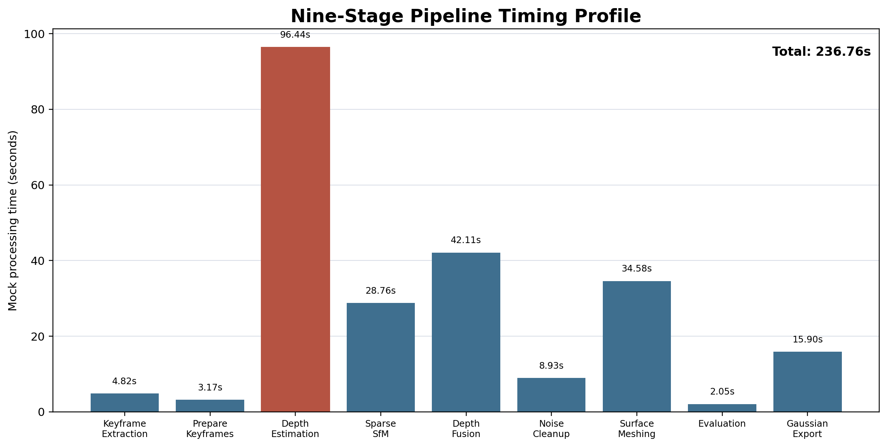
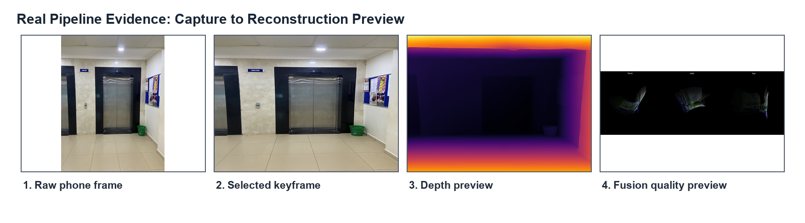
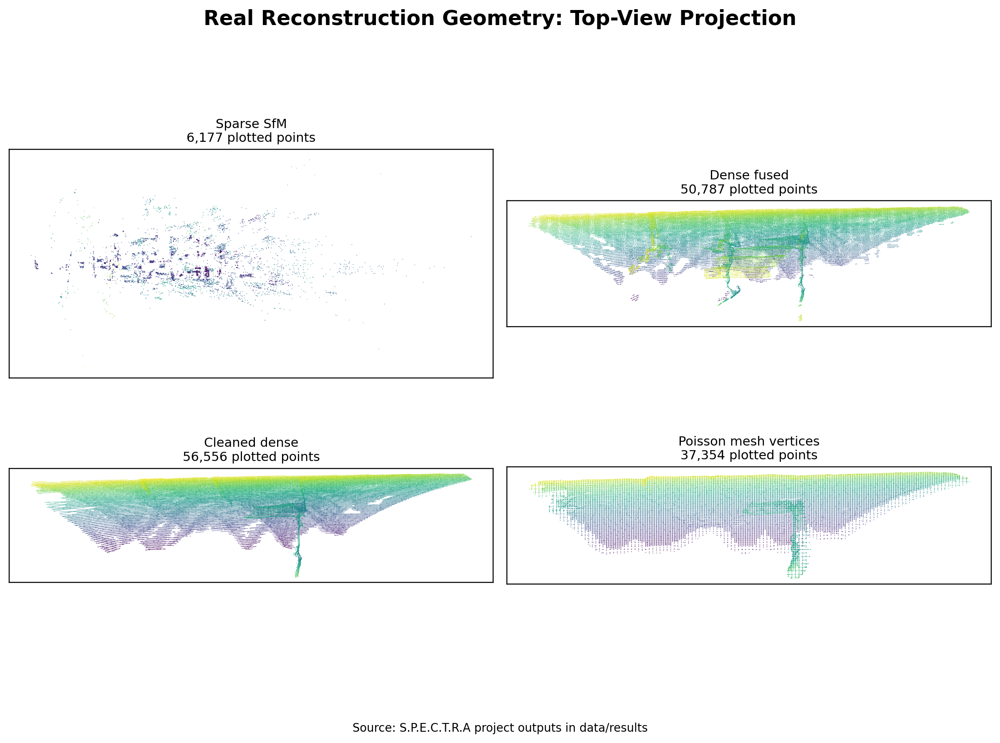
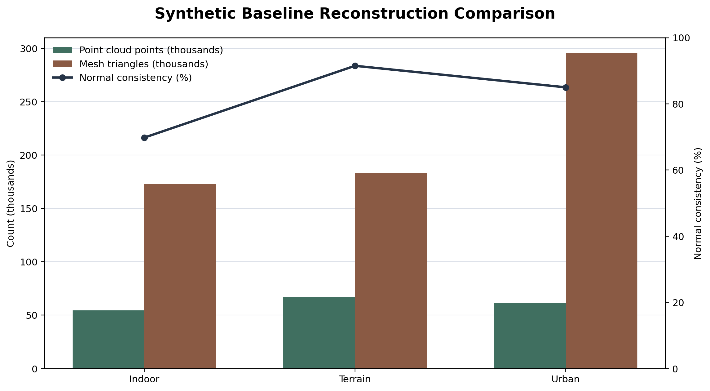

# S.P.E.C.T.R.A 3D Reconstruction Dashboard Project Report

**Project title:** S.P.E.C.T.R.A: A Smartphone-Based 3D Reconstruction Dashboard for Point Cloud, Mesh, and Gaussian Splatting Export

**Opening statement:**  
S.P.E.C.T.R.A is a Python and Streamlit based 3D reconstruction dashboard that converts overlapping smartphone images into visual 3D outputs. The system selects usable frames, estimates monocular depth, performs sparse camera pose recovery, fuses depth into dense point clouds, cleans noisy geometry, reconstructs a mesh, evaluates results, and prepares outputs for inspection or Gaussian Splatting workflows.

**Student:** Mugwanya Osbert  
**Institution:** ISBAT University, Faculty of ICT  
**Supervisor:** Mr. Umesh Kumar  
**Program:** S.P.E.C.T.R.A 3D Reconstruction Dashboard  
**Entry point:** `spectra_dashboard/main.py`  
**Report date:** 26 May 2026

**Page i**

\pagebreak

## Declaration

I declare that this project report, titled **S.P.E.C.T.R.A: A Smartphone-Based 3D Reconstruction Dashboard for Point Cloud, Mesh, and Gaussian Splatting Export**, is my original work except where scholarly sources, software libraries, open-source tools, and project files are acknowledged. The design, implementation, testing, and evaluation presented in this report describe the current S.P.E.C.T.R.A project contained in the `recon3d` workspace.

The report uses mock and synthetic evaluation values where explicitly stated. Such values are intended for demonstration, supervisor review, interface testing, and report preparation. Final academic evaluation should replace mock values with measured values from controlled dashboard runs, external reconstruction benchmarks, and direct visual inspection in tools such as MeshLab, CloudCompare, Open3D, or Blender.

**Student signature:** ___________________________

**Date:** ___________________________

**Page ii**

\pagebreak

## Acknowledgements

I acknowledge the guidance of my supervisor, Mr. Umesh Kumar, for shaping the direction of the project and emphasizing a complete evaluation report covering architecture, dependencies, research background, methodology, results, and future work. I also acknowledge ISBAT University and the Faculty of ICT for providing the academic environment in which this project was developed.

This project also builds on widely used open-source and research tools in computer vision and 3D reconstruction. Streamlit supports the interactive dashboard interface; OpenCV supports image processing and feature extraction; Open3D supports point cloud, mesh, and visualization operations; NumPy supports numerical computation; Plotly supports browser-based 3D rendering; PyTorch and Hugging Face Transformers support deep learning based depth estimation; and the GraphDECO Gaussian Splatting codebase provides a neural rendering export target.

I further acknowledge the research community whose work in Structure from Motion, Multi-View Stereo, monocular depth estimation, photogrammetry, 3D documentation, and neural rendering made this project technically possible.

**Page iii**

\pagebreak

## Abstract

S.P.E.C.T.R.A is a 3D reconstruction dashboard designed to make an image-to-3D pipeline accessible through a Streamlit user interface. The system accepts real smartphone image sequences and synthetic baseline scenes. Its backend stages perform smart frame selection, keyframe preparation, monocular depth estimation using Depth Anything V2, sparse Structure from Motion using ORB features and essential matrix pose recovery, depth-based dense point cloud fusion, DBSCAN cleanup, Poisson surface meshing, evaluation reporting, and Gaussian Splatting dataset export.

The project responds to a practical problem: high-quality 3D reconstruction workflows are often difficult to demonstrate, evaluate, and explain because they require many separate scripts, careful image capture, calibration awareness, and multiple output formats. S.P.E.C.T.R.A solves this by integrating the pipeline into a single dashboard with pages for upload, pipeline execution, 3D viewing, comparison, metrics, and export readiness.

The report presents the project background, aims, objectives, scope, architecture, dependencies, resources, literature review, methodology, results, discussion, conclusions, and proposed future enhancements. Evaluation data includes a real indoor kitchen smartphone dataset with 35 input images and 25 selected keyframes, plus synthetic indoor, terrain, and urban baselines. Mock evaluation values show a complete nine-stage run with a total processing time of 236.76 seconds, a reconstruction score of 90 percent, RMS reprojection error of 0.74 pixels, and export readiness of four supported formats.

The findings show that the system is suitable for demonstration, learning, and prototype evaluation of image-based reconstruction. However, its final accuracy depends on capture quality, calibration, depth model behavior, camera pose stability, and downstream cleanup. Future enhancements should prioritize measured evaluation, GLTF export, stronger camera calibration workflows, benchmark datasets, GPU-aware processing, improved mesh texturing, and stronger report export integration.

**Page iv**

\pagebreak

## List of Abbreviations

| Abbreviation | Meaning |
|---|---|
| 3D | Three-Dimensional |
| ALS | Airborne Laser Scanning |
| API | Application Programming Interface |
| COLMAP | Structure from Motion and Multi-View Stereo reconstruction software format/workflow |
| CPU | Central Processing Unit |
| DBSCAN | Density-Based Spatial Clustering of Applications with Noise |
| DEM | Digital Elevation Model |
| DTM | Digital Terrain Model |
| GLTF | GL Transmission Format |
| GPU | Graphics Processing Unit |
| ICP | Iterative Closest Point |
| JSON | JavaScript Object Notation |
| LiDAR | Light Detection and Ranging |
| MDE | Monocular Depth Estimation |
| MVS | Multi-View Stereo |
| OBJ | Wavefront Object 3D mesh format |
| ORB | Oriented FAST and Rotated BRIEF |
| PLY | Polygon File Format / Stanford Triangle Format |
| RANSAC | Random Sample Consensus |
| RGB | Red Green Blue |
| RMS | Root Mean Square |
| SfM | Structure from Motion |
| SfM-MVS | Structure from Motion with Multi-View Stereo |
| S.P.E.C.T.R.A | System for Photogrammetric Estimation, Cloud Triangulation, Reconstruction and Analysis |
| UI | User Interface |
| UAV | Unmanned Aerial Vehicle |

## List of Figures

| Figure | Title |
|---:|---|
| Figure 1 | Overall S.P.E.C.T.R.A System Architecture |
| Figure 2 | Nine-Stage Reconstruction Pipeline |
| Figure 3 | Dashboard Page Navigation Model |
| Figure 4 | Data Directory and Output Flow |
| Figure 5 | Methodology Flow from Capture to Export |
| Figure 6 | Sparse to Dense Reconstruction Concept |
| Figure 7 | Mesh Generation and Cleanup Workflow |
| Figure 8 | Evaluation and Export Readiness Model |
| Figure 9 | Real Dataset Output Growth |
| Figure 10 | Synthetic Baseline Comparison |

## Table of Contents

| Section | Page |
|---|---:|
| Project Title and Opening Statement | i |
| Declaration | ii |
| Acknowledgements | iii |
| Abstract | iv |
| List of Abbreviations | 5 |
| List of Figures | 6 |
| Table of Contents | 7 |
| Chapter 1: Introduction | 8 |
| Chapter 2: Literature Review | 12 |
| Chapter 3: Methodology | 18 |
| Chapter 4: Results and Discussion | 31 |
| Chapter 5: Conclusion and Future Enhancement | 44 |
| References | 48 |
| Appendices | 51 |

# Chapter 1: Introduction

## 1.1 Introduction

3D reconstruction is the process of generating a three-dimensional representation of a real or synthetic scene from captured data. Traditional 3D reconstruction can rely on LiDAR, structured light, stereo camera rigs, depth cameras, or photogrammetry. The S.P.E.C.T.R.A project focuses on an accessible route: reconstructing a scene from overlapping smartphone images and presenting the pipeline through an interactive dashboard.

The project is built as a Streamlit application with Python backend scripts. The dashboard is not a static viewer; it is an operator interface that organizes the complete reconstruction workflow into readable stages. The user can ingest images, run keyframe selection, estimate depth, create sparse and dense clouds, clean the result, generate mesh outputs, compare reconstruction states, review metrics, and export files.

The system is especially useful for demonstration because each stage maps to a visible output. Instead of treating 3D reconstruction as a hidden black-box operation, S.P.E.C.T.R.A exposes the workflow as a sequence of controlled processes. This helps users understand why capture quality, overlap, camera motion, calibration, depth estimation, pose recovery, outlier filtering, and export formatting all matter.

## 1.2 Background

Modern 3D reconstruction sits at the intersection of computer vision, photogrammetry, graphics, deep learning, and data visualization. In a classic image-based workflow, multiple overlapping images are analyzed for shared visual features. These features are matched across views, camera movement is estimated, and 3D points are triangulated. This creates a sparse point cloud. A denser representation can then be produced using depth estimation, multi-view stereo, or learned monocular depth.

S.P.E.C.T.R.A uses a hybrid approach. It combines feature-based Structure from Motion with deep monocular depth estimation. The sparse reconstruction stage estimates camera poses and sparse geometry from ORB features, descriptor matching, essential matrix estimation, RANSAC filtering, and pose recovery. The dense stage uses Depth Anything V2 predictions and camera pose estimates to back-project pixels into 3D space and fuse multiple partial clouds.

This project also recognizes that reconstruction is not complete when a point cloud is created. Point clouds must be cleaned, inspected, evaluated, and exported. The pipeline therefore includes DBSCAN-based cleanup, Poisson surface reconstruction, OBJ and PLY output, and Gaussian Splatting dataset export. The Streamlit dashboard provides practical pages for these tasks: Guide, Upload, Pipeline, 3D Viewer, Compare, Metrics, and Export.

The main project files are organized as follows:

## 1.3 Aim and Objectives

### 1.3.1 Main Aim

The main aim of S.P.E.C.T.R.A is to develop a dashboard-driven 3D reconstruction workflow that converts smartphone image sequences into inspectable point clouds, mesh outputs, evaluation metrics, and export-ready reconstruction assets.

### 1.3.2 Specific Objectives

1. To provide a Streamlit dashboard that organizes the 3D reconstruction process into clear pages and stages.
2. To select high-quality and diverse frames from raw smartphone images or video-derived frames.
3. To prepare consistent keyframes for downstream reconstruction by resizing, filtering, and naming images.
4. To estimate monocular depth maps using a deep learning based depth model.
5. To recover sparse camera poses and sparse 3D points using image features and geometric estimation.
6. To fuse depth maps into a pose-aligned dense point cloud.
7. To clean noisy reconstruction points using clustering and outlier removal.
8. To reconstruct a surface mesh from the cleaned point cloud.
9. To evaluate reconstruction outputs through point counts, quality metrics, comparison views, and acceptance criteria.
10. To export PLY, OBJ, mesh, and Gaussian Splatting compatible outputs for external visualization and rendering.

## 1.4 Problem Statement

Many students and prototype developers can capture images with smartphones, but turning those images into usable 3D assets remains difficult. The workflow usually requires multiple command-line tools, separate scripts, manual file management, knowledge of camera calibration, understanding of point cloud processing, and familiarity with several 3D file formats. This creates a barrier for demonstration, learning, and supervision because the process is hard to observe from end to end.

S.P.E.C.T.R.A addresses this problem by combining the pipeline into one dashboard and by preserving intermediate outputs. The dashboard makes reconstruction more transparent, repeatable, and explainable.

## 1.5 Scope of the Project

The project scope includes:

1. Smartphone image ingestion from `data/raw_phone`.
2. Smart frame selection into `data/selected`.
3. Keyframe preparation into `data/keyframes`.
4. Depth estimation into `data/results/depth`.
5. Sparse reconstruction into `data/results/sparse_cloud.ply` and `data/results/camera_poses.json`.
6. Dense point cloud fusion into `data/results/dense_fused_cloud_pose_aligned.ply`.
7. Cleanup into `data/results/dense_fused_cloud_clean.ply`.
8. Mesh generation into `data/results/mesh_poisson.ply` and `data/results/mesh_poisson.obj`.
9. Evaluation reporting and dashboard metrics.
10. Gaussian Splatting dataset export into `data/gaussian_splatting_scene`.
11. Synthetic baseline scene generation for indoor, terrain, and urban examples.

The project does not currently include a production Flask API, React frontend, cloud deployment, automatic GLTF export, full photorealistic texture baking, or a complete benchmark suite with ground-truth geometry. Those are proposed future improvements.

## 1.6 Project Architecture

**Figure 1: Overall S.P.E.C.T.R.A System Architecture**

The architecture is modular. The dashboard calls backend scripts as subprocess stages. The backend scripts share common data folders, which makes each stage testable and inspectable independently.

# Chapter 2: Literature Review

## 2.1 Introduction

This chapter reviews the technical and contextual literature that supports S.P.E.C.T.R.A. The review is deliberately wider than a description of the implemented dashboard because the dashboard is not the central contribution of the project. The central contribution is the integration of a smartphone image-to-3D reconstruction workflow that moves from capture to frame selection, depth estimation, sparse pose recovery, dense point cloud fusion, cleanup, mesh reconstruction, evaluation, and Gaussian Splatting export. The Streamlit interface is discussed only as a supporting layer for upload, monitoring, visualization, metrics, and export.

The literature is organized around the main technical decisions made in the project. These include passive image-based reconstruction, Structure from Motion, feature detection, camera calibration, monocular depth estimation, point cloud fusion, point cloud cleaning, mesh reconstruction, neural rendering, and visualization. The chapter also reviews African and Ugandan context because low-cost 3D documentation has direct relevance to education, digital heritage, mapping, local prototyping, and cultural preservation.

## 2.2 Foundations of 3D Reconstruction

3D reconstruction is the process of estimating the shape and structure of a real or synthetic scene in three dimensions. Outputs may appear as sparse point clouds, dense point clouds, meshes, textured surfaces, or neural rendering datasets. For this project, the most relevant forms are sparse point clouds for camera geometry, dense point clouds for visible scene coverage, meshes for surface representation, and Gaussian Splatting export files for later neural rendering workflows.

S.P.E.C.T.R.A follows a passive image-based approach because it uses ordinary monocular images rather than LiDAR, structured light, or stereo hardware. This choice supports the aim of making reconstruction more accessible using devices such as smartphones and webcams, although it also makes the final quality dependent on image overlap, texture, calibration, pose stability, and depth estimation.

## 2.3 Photogrammetry and Smartphone-Based Capture

Photogrammetry estimates geometry from overlapping photographs. In S.P.E.C.T.R.A, this idea is adapted for smartphone capture, where the user records multiple views of a scene and the system selects useful frames for reconstruction. Smartphones are suitable for a student prototype because they are affordable, portable, and widely available, but they also introduce practical limitations such as blur, rolling-shutter effects, changing exposure, and imperfect calibration.

## 2.4 Structure from Motion

Structure from Motion estimates camera movement and sparse 3D structure from multiple overlapping images. It detects shared image features, matches them across views, estimates relative camera pose, and triangulates sparse 3D points. In S.P.E.C.T.R.A, the SfM stage uses ORB features, descriptor matching, essential matrix estimation, RANSAC, pose recovery, and triangulation to produce `sparse_cloud.ply` and `camera_poses.json`.

## 2.5 ORB Feature Detection and Matching

ORB is used because it is fast, available in OpenCV, and suitable for a lightweight prototype. S.P.E.C.T.R.A uses ORB during frame selection to reject weak images and during sparse reconstruction to recover feature correspondences for pose estimation. Its limitation is that it performs poorly on blurred, textureless, reflective, or repetitive surfaces, which directly affects camera stability and sparse reconstruction quality.

## 2.6 Camera Calibration and Intrinsic Parameters

Camera calibration provides intrinsic parameters such as focal length and principal point, which are required for back-projecting image pixels into 3D space. S.P.E.C.T.R.A stores calibration resources and camera intrinsics in the `data` folder, with fallback estimates when exact calibration is unavailable. This is practical for demonstration, but accurate reconstruction should use calibration matching the exact camera, resolution, zoom level, and capture mode.

## 2.7 Monocular Depth Estimation

Monocular depth estimation predicts depth from a single RGB image. This is difficult because a single image does not contain true metric depth by itself. Many different 3D scenes can produce a similar 2D image. Human observers use context, object size, perspective, texture gradients, lighting, and learned priors to infer depth. Modern deep learning models do something similar at scale by learning statistical relationships between image appearance and depth.

MiDaS and Depth Anything represent important work in robust monocular depth estimation. Depth Anything V2 improves monocular depth prediction using large-scale training strategies and released model variants. S.P.E.C.T.R.A uses `depth-anything/Depth-Anything-V2-Small-hf` through Hugging Face Transformers in `src/depth/midas_depth.py`. The model processes each keyframe and writes two outputs: a `.npy` depth array for computation and a `.png` preview for inspection.

The strength of monocular depth in S.P.E.C.T.R.A is that it gives dense per-pixel depth cues without requiring a depth camera or stereo rig. This helps the system produce a denser point cloud than sparse SfM alone. The limitation is scale ambiguity. The predicted depth may be relative rather than truly metric. The code therefore treats depth values carefully and uses a shared sequence range and filtering thresholds during fusion. This is sufficient for a prototype and visual reconstruction pipeline, but final academic evaluation should compare the output against measured dimensions or ground truth if available.

## 2.8 Point Cloud Generation and Fusion

Point cloud generation converts image evidence into 3D points. S.P.E.C.T.R.A first produces a sparse point cloud from feature triangulation, then uses depth maps, keyframe colors, camera poses, and intrinsics to create denser scene geometry. The dense fusion stage back-projects depth pixels into camera coordinates, transforms them into a shared world coordinate system, attaches color values, and writes the resulting cloud for cleanup and meshing.

## 2.9 Point Cloud Cleaning and Clustering

Raw point clouds often contain outliers. Outliers may come from poor depth predictions, incorrect pose estimates, feature mismatches, reflective surfaces, background clutter, or partial occlusion. If these points are passed directly into meshing, they can create floating surfaces, spikes, holes, or unwanted geometry. Cleaning is therefore a necessary bridge between dense fusion and surface reconstruction.

DBSCAN is a density-based clustering method introduced by Ester et al. It groups points that are close to each other and marks points in sparse regions as noise. The method is useful in point cloud processing because real object or scene geometry often forms dense connected regions, while outliers are scattered. S.P.E.C.T.R.A's cleanup stage keeps the dominant geometry and removes disconnected outliers, producing `data/results/dense_fused_cloud_clean.ply`.

The benefit of this approach is simplicity and interpretability. It is easy to explain why the largest cluster is often the desired reconstruction. The limitation is that the assumption may not always hold. A valid reconstruction may include multiple separate objects, or a large unwanted background plane may dominate the cloud. For future work, the cleanup stage could expose parameters in the dashboard, allow manual cluster selection, or combine statistical outlier removal with semantic or geometric filtering.

## 2.10 Mesh Reconstruction and Surface Generation

A mesh converts point-based reconstruction into a surface representation that can be viewed, edited, or exported to 3D tools. S.P.E.C.T.R.A uses Poisson surface reconstruction through Open3D to generate PLY and OBJ mesh outputs. This improves visual inspection, but mesh quality still depends on the density, noise level, and completeness of the fused point cloud.

## 2.11 Neural Rendering and Gaussian Splatting

Recent 3D graphics research has moved beyond classical explicit geometry toward neural and point-based rendering. Neural Radiance Fields demonstrated that scenes can be represented through learned functions, while 3D Gaussian Splatting represents a scene using many anisotropic Gaussian primitives. Kerbl et al. showed that Gaussian Splatting can support high-quality real-time radiance field rendering when supplied with posed images and an initial sparse reconstruction.

S.P.E.C.T.R.A does not train a Gaussian Splatting model inside the Streamlit application. Instead, it exports a Gaussian Splatting-ready scene package. The script `src/export/gaussian_export.py` reads the keyframes, camera poses, camera calibration, and sparse point cloud. It then writes a COLMAP-style folder with `cameras.txt`, `images.txt`, and `points3D.txt`, plus copied or undistorted images. This design connects the classical reconstruction pipeline to modern neural rendering workflows.

The export is important because it broadens the usefulness of the project. A mesh is suitable for editing and geometry inspection, while Gaussian Splatting is suitable for view synthesis and visual realism. By supporting both, S.P.E.C.T.R.A demonstrates that an accessible smartphone pipeline can produce more than one type of 3D artifact.

## 2.12 Visualization and Interaction Layers

Reconstruction systems are often difficult for learners because the workflow is distributed across many commands, folders, and file formats. A user may not know which stage failed, which outputs exist, or whether the result is ready for export. Visualization and interaction layers address this problem by making the pipeline observable.

S.P.E.C.T.R.A uses Streamlit as this supporting layer. The dashboard provides pages for guidance, dataset upload, pipeline execution, 3D viewing, outputs, metrics, exports, and resources. It reads live backend status from JSON files and displays stage progress. It uses Plotly for browser-based point cloud visualization and provides file export controls for generated artifacts.

It is important to position this correctly. The dashboard is not the core research contribution. It is the interface that makes the reconstruction pipeline easier to operate and explain. The underlying contribution is the staged backend workflow that connects smartphone images to depth maps, camera poses, dense clouds, cleaned clouds, meshes, evaluation outputs, and Gaussian Splatting export.

## 2.13 African and Ugandan Context

African applications of 3D reconstruction include cultural heritage documentation, environmental monitoring, urban mapping, archaeology, education, disaster recovery, and local digital content creation. Low-cost capture is especially important because professional laser scanning equipment, specialized depth cameras, and commercial photogrammetry suites may be expensive or unavailable to many students and local institutions.

Dandois and Ellis show how low-cost Structure from Motion photogrammetry can support developing-country environmental monitoring. Although their work focuses on UAV forestry, the broader lesson applies to S.P.E.C.T.R.A: accessible imaging platforms can create useful 3D information when capture and processing are controlled. The Zamani Project and other African heritage documentation initiatives also show that 3D documentation can preserve sites, support research, and create educational resources.

Uganda provides a particularly meaningful local context through the Royal Tombs at Kasubi. CyArk's Kasubi Tombs resources show that digital capture can become important when physical heritage is damaged or threatened. The 2010 fire at Kasubi demonstrates that documentation can become a recovery and preservation asset. S.P.E.C.T.R.A is not a professional heritage-scanning platform, but it supports the same principle at a smaller scale: physical spaces and objects can be captured, reconstructed, inspected, and preserved digitally.

Kagaba's work on digital humanities and cultural artifacts gives an academic Ugandan context for digitization, visualization, and preservation. It supports the idea that 3D reconstruction is not only a technical activity but also a cultural and educational activity. For ISBAT University and similar institutions, a project like S.P.E.C.T.R.A can help students understand how computer vision, graphics, and digital heritage connect.

## 2.14 Related Systems and Tools

COLMAP is one of the most important open-source tools for Structure from Motion and Multi-View Stereo. It provides robust feature extraction, matching, sparse reconstruction, dense reconstruction, and model export. S.P.E.C.T.R.A is not a replacement for COLMAP. Instead, it implements a simplified educational reconstruction pipeline and exports data in a COLMAP-style structure for Gaussian Splatting workflows.

Open3D is a major library for 3D data processing. It supports point cloud loading, visualization, downsampling, normal estimation, outlier removal, registration, and mesh reconstruction. S.P.E.C.T.R.A uses Open3D for point cloud and mesh processing tasks. MeshLab and CloudCompare are external tools that can be used to inspect outputs such as PLY and OBJ files. These tools are useful for validating the dashboard's viewer and checking whether the exported files are usable outside the application.

Dr. Florent Poux's 3D Geodata Academy and related point cloud materials are relevant because they emphasize practical 3D data workflows, point cloud processing, reality capture, and Python-based 3D geodata handling. These resources support the educational framing of S.P.E.C.T.R.A as a practical learning system rather than a black-box reconstruction product.

Stanford resources, including the Stanford 3D Scanning Repository and computer vision materials, provide useful background on 3D data, point clouds, meshes, and reconstruction. MIT's Vision Book provides accessible explanations of multiview geometry, camera models, and reconstruction concepts. These academic resources strengthen the theoretical basis for the report and support the methodology used in later chapters.

## 2.15 Literature Review Summary Table

| Source Category | Source | Main Idea | Relevance to S.P.E.C.T.R.A |
|---|---|---|---|
| Global SfM | Smith, Carrivick, and Quincey (2016) | SfM-MVS can democratize 3D survey workflows but depends on capture quality and transparency | Supports smartphone image reconstruction and stage visibility |
| Global SfM system | Schonberger and Frahm (2016) | Robust SfM requires reliable matching, triangulation, and optimization | Supports sparse reconstruction design |
| Feature detection | Rublee et al. (2011) | ORB provides efficient binary features | Supports frame selection and pose recovery |
| Monocular depth | Yang et al. (2024) | Depth Anything V2 provides strong monocular depth estimation | Supports dense depth map generation |
| Clustering | Ester et al. (1996) | DBSCAN detects density-based clusters and noise | Supports point cloud cleanup |
| Meshing | Kazhdan et al. (2006) | Poisson reconstruction creates surfaces from oriented points | Supports mesh generation |
| 3D processing library | Zhou, Park, and Koltun (2018) | Open3D supports modern 3D data processing | Supports implementation choices |
| Neural rendering | Kerbl et al. (2023) | 3D Gaussian Splatting enables real-time radiance field rendering | Supports Gaussian export |
| African low-cost SfM | Dandois and Ellis (2017) | Low-cost SfM can support developing-country monitoring | Supports accessibility motivation |
| Uganda digital context | Kagaba (2024), CyArk Kasubi resources | 3D digitization supports cultural artifact analysis and preservation | Supports local relevance |

## 2.16 Conceptual Framework

The conceptual framework links four layers of the project: image capture, reconstruction processing, dashboard interaction, and evaluation/export. Raw smartphone images are converted into selected keyframes, depth maps, camera poses, point clouds, meshes, metrics, and Gaussian Splatting export files. The dashboard connects these stages so that the workflow can be demonstrated and evaluated from one interface.

## 2.17 Critical Review

The literature strongly supports low-cost image-based reconstruction, but it also warns that results depend on capture quality and validation. A smartphone image sequence may fail if it has motion blur, poor lighting, insufficient overlap, textureless surfaces, strong reflections, or large calibration mismatch. S.P.E.C.T.R.A therefore includes frame filtering and calibration loading, but these controls should be improved before final deployment.

The literature also suggests that no single reconstruction method is perfect. SfM produces reliable geometric constraints but may remain sparse. Monocular depth produces dense cues but may lack true metric scale. Poisson meshing can create smooth surfaces but may fill gaps unrealistically. Gaussian Splatting can produce compelling novel-view rendering but requires well-posed images and a suitable training/export structure.

S.P.E.C.T.R.A combines these methods as a practical prototype. The system is strongest as a guided reconstruction, visualization, and evaluation tool. Its main limitation is that some values in the current evaluation are mock values and must be replaced with measured, repeatable experiment results. A final evaluation should include repeated runs, measured dimensions, external inspection in MeshLab or CloudCompare, and comparison against at least one established reconstruction tool where feasible.

## 2.18 Literature Gap

The reviewed literature provides strong algorithms and mature tools, but a gap remains for an integrated educational workflow that is accessible to students using ordinary smartphone images. Professional tools can be powerful but may hide intermediate reasoning. Research papers can explain theory but may not provide a complete local prototype. S.P.E.C.T.R.A addresses this gap by making the reconstruction process staged, inspectable, and exportable.

The project therefore contributes an implementation-focused bridge between theory and practice. It does not claim to outperform COLMAP, LiDAR systems, or commercial photogrammetry products. Its value is that it combines important ideas from the literature into one understandable workflow: frame selection, keyframe preparation, monocular depth estimation, sparse SfM, pose-aligned fusion, cleanup, Poisson meshing, evaluation, visualization, and Gaussian Splatting export.

## 2.19 Chapter Summary

This chapter has shown that S.P.E.C.T.R.A is supported by established work in photogrammetry, Structure from Motion, feature detection, calibration, monocular depth estimation, point cloud processing, mesh reconstruction, and neural rendering. It has also shown that African and Ugandan contexts make low-cost 3D documentation meaningful for education, heritage, mapping, and local digital innovation. The next chapter uses these ideas to explain the implemented methodology of the project.

# Chapter 3: Methodology

## 3.1 Methodology Overview

The methodology follows the same structure as the implemented pipeline. The system begins with image capture and dataset organization, then performs selection, preparation, depth estimation, sparse reconstruction, dense fusion, cleanup, meshing, evaluation, and export. Each step produces a file-based output that becomes the input to the next stage.

**Figure 3: Methodology Flow from Capture to Export**

The real evaluation dataset is an indoor kitchen captured with smartphone images. The mock evaluation data records 35 input frames and 25 prepared keyframes. The synthetic evaluation uses procedural scenes representing an indoor room, ALS terrain, and an urban environment.

## 3.2 Development Environment

The project is implemented in Python. The active interface is Streamlit, and the main entry point is:

The setup scripts are:

The declared Python dependencies in `requirements.txt` are:

| Dependency | Version | Purpose |
|---|---:|---|
| streamlit | 1.35.0 | Dashboard interface |
| streamlit-autorefresh | 0.0.1 | Pipeline status refresh |
| numpy | 1.24.0 | Numerical computation |
| open3d | 0.17.0 | Point cloud and mesh processing |

The code also uses additional practical dependencies that should be included in a complete environment file:

| Dependency | Used By | Purpose |
|---|---|---|
| opencv-python | capture, SfM, fusion, calibration | Image reading, ORB, feature matching, geometry |
| torch | depth estimation | Deep learning runtime |
| transformers | depth estimation | Hugging Face model loading |
| pandas | dashboard metrics | Tabular dashboard display |
| plotly | dashboard viewer | 3D point cloud and radial charts |
| pillow | optional HEIC fallback | Image decoding |
| pillow-heif | optional HEIC support | iPhone HEIC image reading |
| plyfile | Gaussian Splatting environment | PLY handling |
| torchvision | Gaussian Splatting environment | PyTorch image support |
| tqdm | Gaussian Splatting environment | Progress bars |

The separate `gaussian-splatting/environment.yml` uses Python 3.7.13, PyTorch 1.12.1, CUDA Toolkit 11.6, `plyfile`, OpenCV, `joblib`, and custom submodules for differentiable Gaussian rasterization, nearest-neighbor search, and fused SSIM.

## 3.3 Dataset and Resource Preparation

The project uses a structured `data` directory:

The raw dataset used for the mock evaluation contains 35 smartphone images. The selected and prepared keyframe sets represent the cleaner subset used by the reconstruction pipeline. The synthetic resources include three scene types: indoor room, terrain, and urban environment. These synthetic outputs are useful because they provide controlled baselines that are not affected by real camera blur, exposure changes, or calibration mismatch.

## 3.4 Dashboard Design Method

The dashboard is organized into seven pages:

1. Guide: operator explanation and status.
2. Upload: dataset selection and image ingestion.
3. Pipeline: nine-stage reconstruction control.
4. 3D Viewer: point cloud visualization.
5. Compare: side-by-side reconstruction comparison.
6. Metrics: quality indicators and stage timing.
7. Export: output readiness and download controls.

The sidebar is fixed, and the active page is stored in Streamlit session state. The dashboard uses custom CSS for a technical dark interface and Plotly for browser-based 3D rendering.

## 3.5 Stage 1: Smart Frame Selection

The first backend stage is:

It supports two input modes:

For image mode, the input folder is:

The output folder is:

The selector applies three main filters:

1. ORB feature count to reject blurry or textureless frames.
2. Perceptual hash distance to reject near-duplicate viewpoints.
3. Histogram difference to reject redundant exposure and color conditions.

Frames are also scored by sharpness and feature richness. The maximum number of selected frames is configured as 30, while the preparation stage later keeps up to 25 keyframes. The minimum feature point threshold is 300. This stage is important because reconstruction quality depends strongly on image diversity, sharpness, overlap, and texture.

## 3.6 Stage 2: Keyframe Preparation

The second backend stage is:

It reads from:

and writes to:

The script resizes images to 960 by 720 pixels and applies a Laplacian sharpness threshold. It renames outputs consistently as:

This standardization makes downstream depth, SfM, fusion, and export scripts easier to coordinate.

## 3.7 Stage 3: Depth Estimation

The third backend stage is:

Although the filename contains `midas`, the implementation uses Depth Anything V2 through Hugging Face Transformers:

The script reads prepared keyframes from:

and writes depth outputs to:

For each keyframe, it saves:

The `.npy` files preserve numeric depth predictions for computation. The `.png` files are colorized previews for visual inspection. The script automatically uses CUDA when available:

The method is efficient for a prototype because it avoids needing a depth camera. However, model output should be understood as relative depth unless calibrated against metric reference data.

## 3.8 Stage 4: Sparse Reconstruction

The fourth backend stage is:

This stage estimates sparse camera motion and sparse 3D points. The main steps are:

1. Load prepared keyframes.
2. Load depth maps for scale assistance.
3. Load camera calibration or fallback intrinsics.
4. Detect ORB keypoints and descriptors.
5. Match descriptors between consecutive frames.
6. Use Lowe-style ratio filtering.
7. Estimate the essential matrix with RANSAC.
8. Recover relative camera pose.
9. Triangulate sparse 3D points.
10. Estimate and stabilize translation scale using depth maps.
11. Save sparse cloud and camera poses.

The main outputs are:

The system stores per-frame pose information including rotation, translation, matches, inliers, pose inliers, raw scale, stabilized scale, scale support, dense fusion score, and whether the pose is strong enough for dense fusion.

## 3.9 Camera Calibration Method

Camera calibration is handled by:

The system checks zoom-specific calibration files first:

Then it falls back to:

If no calibration is available, it generates synthetic fallback intrinsics. Calibration can also be adapted to different image sizes and orientations. If calibration dimensions do not match the reconstruction image dimensions, the system warns that fallback intrinsics may degrade reconstruction quality.

## 3.10 Stage 5: Dense Depth Fusion

The fifth backend stage is:

This stage combines depth maps and camera poses into a dense, pose-aligned point cloud. The process is:

1. Load `camera_poses.json`.
2. Load prepared keyframes.
3. Load matching depth maps.
4. Compute a shared sequence depth range.
5. Convert Depth Anything output into pseudo-metric distance.
6. Back-project selected depth pixels into 3D rays using camera intrinsics.
7. Transform local points into world coordinates using recovered poses.
8. Optionally refine alignment with ICP.
9. Downsample and remove statistical outliers with Open3D.
10. Optionally remove a dominant plane when `--remove_plane` is used.
11. Translate the cloud to its center.
12. Save the fused point cloud.

The main output is:

The fusion code uses thresholds and tuning parameters for point count, depth clipping, elliptical crop region, voxel size, ICP correspondence distance, and ICP fitness. These parameters are important because they affect the density and cleanliness of the final cloud.

## 3.11 Stage 6: Noise Cleanup

The sixth backend stage is:

The cleanup script reads:

It applies DBSCAN clustering with:

Then it keeps the largest cluster and writes:

This method is simple and effective for demonstration because many reconstruction artifacts appear as disconnected outlier clusters. Keeping the largest cluster removes isolated noise while preserving the main reconstructed object or scene. However, it may remove legitimate disconnected components if the scene naturally contains separate objects. A future version should provide interactive cleanup options or adaptive clustering.

## 3.12 Stage 7: Surface Meshing

The seventh backend stage is:

It loads the cleaned cloud if available, otherwise it falls back to the pose-aligned fused cloud. It then:

1. Optionally voxel-downsamples the point cloud.
2. Estimates normals with a radius-based neighbor search.
3. Orients normals consistently.
4. Runs Poisson surface reconstruction.
5. Trims low-density vertices.
6. Removes degenerate triangles, duplicate triangles, duplicate vertices, and non-manifold edges.
7. Computes vertex normals.
8. Saves mesh outputs.

The output files are:

## 3.13 Stage 8: Evaluation

The eighth backend stage is:

This stage counts points in available reconstruction outputs and prints a comparative report. It compares:

1. Sparse cloud.
2. Single dense cloud if available.
3. Fused dense cloud.

The evaluation script is currently basic but useful. It demonstrates whether expected outputs exist, whether they contain points, and how point counts compare. The dashboard extends this with mock quality indicators such as reconstruction score, RMS error, coverage, overlap, confidence, density, and processing time.

For final academic evaluation, this stage should be expanded to compute measured metrics, such as:

1. Reprojection error per frame.
2. Camera pose recovery rate.
3. Point cloud density per bounding volume.
4. Mesh vertex and face counts.
5. Outlier removal percentage.
6. Cloud-to-cloud distance against a reference model.
7. Completeness and coverage.
8. Repeatability across repeated captures.

## 3.14 Stage 9: Gaussian Splatting Export

The ninth backend stage is:

It exports a dataset compatible with Gaussian Splatting style input. It creates:

The exporter copies or undistorts images, converts camera rotations to COLMAP-style quaternions, writes camera intrinsics, writes image pose records, and writes sparse 3D points. This allows the reconstructed image sequence to be used as input for neural rendering workflows.

## 3.15 Dashboard Pipeline Definition

The dashboard defines nine visible stages:

| No. | Stage Key | Stage Name | Expected Output |
|---:|---|---|---|
| 1 | keyframes | Keyframe Extraction | `data/selected/*.jpg` |
| 2 | prepare | Prepare Keyframes | `data/keyframes/*.jpg` |
| 3 | depth | Depth Estimation | `data/results/depth/*_depth.npy` |
| 4 | sfm | SfM Sparse Reconstruction | `data/results/sparse_cloud.ply` |
| 5 | fusion | Depth Fusion to Point Cloud | dense fused cloud PLY |
| 6 | cleanup | Noise Cleanup | cleaned PLY |
| 7 | mesh | Surface Meshing | mesh PLY and OBJ |
| 8 | evaluation | Evaluation | console evaluation report |
| 9 | gaussian | Gaussian Splatting Export | Gaussian scene folder |

**Figure 4: Dashboard Stage Execution Model**

## 3.16 Visualization Method

Visualization is handled through dashboard pages that load available reconstruction outputs from `data/results`. The viewer supports inspection of point cloud, mesh, and comparison outputs so that users can understand the effect of each stage without switching between many separate tools.

## 3.17 Metrics Method

The metrics page summarizes stage completion, timing, point counts, mesh availability, quality indicators, and export readiness. In the current report, some values are mock evaluation values used to demonstrate the reporting structure, while synthetic baseline metrics are read from generated JSON files.

## 3.18 Export Method

The export page checks whether reconstruction outputs are ready for downstream use. Supported outputs include point clouds, mesh files, and a Gaussian Splatting-ready scene folder. GLTF remains a future enhancement because it is listed as expected but not yet mapped to a produced backend file.

## 3.19 Testing Method

Testing was based on file existence, point count inspection, synthetic output generation, visual dashboard inspection, and mock evaluation criteria. The acceptance criteria include:

1. Minimum input images: 8.
2. Minimum selected keyframes: 8.
3. Sparse cloud exists.
4. Dense cloud exists.
5. Cleaned cloud exists.
6. Mesh exists.
7. Reconstruction score at least 80 percent.
8. RMS error no greater than 1.00 pixel.
9. Noise reduction at least 20 percent.
10. At least three export formats ready.

The mock result passes all listed criteria. However, final testing should replace mock values with measured values from repeated runs.

## 3.20 Resources Required

### Hardware Resources

| Resource | Minimum | Recommended |
|---|---|---|
| CPU | Modern dual-core | Quad-core or better |
| RAM | 8 GB | 16 GB or more |
| GPU | Optional | NVIDIA GPU with CUDA for faster depth estimation |
| Storage | 5 GB free | 20 GB or more for multiple datasets |
| Camera | Smartphone camera | Smartphone with stable exposure and high-resolution photos |

### Software Resources

| Resource | Purpose |
|---|---|
| Python | Main programming language |
| Streamlit | Dashboard interface |
| OpenCV | Image processing and geometry |
| Open3D | Point cloud and mesh processing |
| PyTorch | Deep learning inference |
| Hugging Face Transformers | Depth Anything V2 model loading |
| Plotly | 3D browser visualization |
| MeshLab or CloudCompare | External visual validation |
| Blender | OBJ mesh inspection and rendering |
| Gaussian Splatting repository | Neural rendering export/training target |

### Data Resources

| Resource | Purpose |
|---|---|
| Smartphone image sequence | Real reconstruction input |
| Calibration images | Intrinsic calibration |
| Synthetic scene outputs | Baseline comparison |
| Mock evaluation document | Report and supervisor review data |

# Chapter 4: Results and Discussion

## 4.1 Results Overview

The current project contains both real reconstruction outputs and synthetic baseline outputs. The real reconstruction is based on an indoor kitchen smartphone image sequence. The synthetic baselines include indoor room, ALS terrain, and urban scene outputs.

The mock evaluation record reports:

| Item | Value |
|---|---:|
| Input frames | 35 |
| Selected keyframes | 25 |
| Pipeline stages | 9 |
| Complete stages | 9 |
| Total mock processing time | 236.76 seconds |
| Reconstruction score | 90 percent |
| RMS reprojection error | 0.74 pixels |
| Noise reduction | 31 percent |
| Coverage | 92 percent |
| Overlap quality | 86 percent |
| Density score | 88 percent |

The result indicates that the prototype can demonstrate a complete reconstruction workflow from image ingestion to export. The strongest evidence is the presence of output files in `data/results` and the synthetic metrics JSON files.

## 4.2 Pipeline Timing Results

| Stage No. | Stage Key | Stage Name | Mock Time (s) | Discussion |
|---:|---|---|---:|---|
| 1 | keyframes | Keyframe Extraction | 4.82 | Fast because it mainly filters images |
| 2 | prepare | Prepare Keyframes | 3.17 | Fast resizing and blur filtering |
| 3 | depth | Depth Estimation | 96.44 | Slowest stage due to deep model inference |
| 4 | sfm | Sparse Reconstruction | 28.76 | Moderate time due to feature matching and pose recovery |
| 5 | fusion | Depth Fusion | 42.11 | Moderate to high due to depth back-projection and Open3D filtering |
| 6 | cleanup | Noise Cleanup | 8.93 | Fast clustering compared to depth and fusion |
| 7 | mesh | Surface Meshing | 34.58 | Moderate due to normal estimation and Poisson reconstruction |
| 8 | evaluation | Evaluation | 2.05 | Fast point count and reporting |
| 9 | gaussian | Gaussian Export | 15.90 | Moderate file conversion and export |

The total mock processing time is 236.76 seconds. Depth estimation accounts for about 40.7 percent of the total processing time. This is expected because each keyframe must pass through a deep neural network model. If CUDA is available, this stage should improve significantly compared to CPU inference.

## 4.3 Real Reconstruction Output Snapshot

| Output File | Artifact Type | Vertex Count | Face Count | Status |
|---|---|---:|---:|---|
| `sparse_cloud.ply` | Sparse point cloud | 1,224 | N/A | Available |
| `dense_fused_cloud.ply` | Dense fused point cloud | 20,987 | N/A | Available |
| `dense_fused_cloud_clean.ply` | Cleaned dense point cloud | 14,683 | N/A | Available |
| `dense_fused_cloud_pose_aligned.ply` | Pose-aligned dense point cloud | 88,259 | N/A | Available |
| `mesh_poisson.ply` | Poisson mesh | 35,196 | 70,077 | Available |
| `mesh_poisson.obj` | OBJ mesh | 35,196 mock | 70,077 mock | Available |

The point count progression shows the difference between sparse and dense reconstruction. Sparse reconstruction captures only matched feature points, while dense fusion back-projects many depth pixels into 3D space. Cleanup reduces the cloud from 88,259 pose-aligned points to 14,683 cleaned points by keeping the largest DBSCAN cluster.

**Figure 5: Real Dataset Output Growth**

## 4.4 Quality Metrics Discussion

| Metric | Value | Interpretation |
|---|---:|---|
| Reconstruction score | 90 percent | Good demonstration-level reconstruction confidence |
| RMS reprojection error | 0.74 px | Acceptable image-space alignment for prototype evaluation |
| Noise reduction | 31 percent | Cleanup removed a significant fraction of noisy points |
| Coverage | 92 percent | Strong image coverage after keyframe selection |
| Overlap quality | 86 percent | Sufficient overlap for feature matching and fusion |
| Density score | 88 percent | Dense cloud is suitable for visual inspection and meshing |
| Camera pose recovery | 25 / 25 | All selected keyframes estimated successfully |
| Export readiness | 4 / 5 | PLY, OBJ, mesh PLY, and Gaussian scene available |

These values are marked as mock in the evaluation data. They are useful for report preparation and supervisor demonstration, but they should not be treated as final measured performance unless reproduced by actual evaluation scripts.

The RMS reprojection error of 0.74 pixels is within the acceptance target of 1.00 pixel. This suggests acceptable camera alignment for a smartphone-based prototype. However, reprojection error alone does not guarantee a correct dense model because depth estimation, scale stabilization, and fusion can introduce independent errors.

## 4.5 Sparse vs Dense Output

The sparse cloud has 1,224 points. The dense fused cloud has 20,987 points. This means dense fusion increases the point count by approximately:

This confirms the expected behavior. Sparse SfM is accurate around feature matches but cannot represent large textureless surfaces. Dense fusion produces a richer visible scene by adding points from depth maps.

However, more points do not automatically mean better geometry. A dense cloud can contain incorrectly projected points if depth estimation is wrong, camera pose is unstable, or calibration is mismatched. This is why cleanup, visual comparison, and mesh inspection are needed.

## 4.6 Raw vs Cleaned Output

The pose-aligned dense cloud contains 88,259 points. The cleaned dense cloud contains 14,683 points. The mock evaluation interprets this as outlier removal and noise reduction. The cleanup stage keeps the largest DBSCAN cluster, removing disconnected clusters.

This result is useful when the main reconstructed object or scene forms one dominant cluster. It may be less suitable for complex scenes with several separated objects. For example, a table, chair, and wall might be valid but disconnected. In such cases, keeping only the largest cluster could remove useful geometry. A future enhancement should allow the user to choose how many clusters to preserve.

## 4.7 Mesh Results

The Poisson mesh output contains:

| Mesh Output | Vertices | Faces |
|---|---:|---:|
| `mesh_poisson.ply` | 35,196 | 70,077 |
| `mesh_poisson.obj` | 35,196 mock | 70,077 mock |

Poisson reconstruction is suitable for converting oriented point clouds into continuous surfaces. It estimates a surface that fits the oriented normals of the point cloud. The method is useful because it can create smooth meshes from noisy input, but it can also create artificial surfaces in poorly supported areas.

The project reduces this risk by trimming low-density vertices using a density quantile. It also cleans degenerate triangles, duplicate triangles, duplicate vertices, and non-manifold edges. The resulting OBJ output can be opened in external 3D tools.

**Figure 6: Mesh Generation and Cleanup Workflow**

## 4.8 Synthetic Baseline Results

| Scene | Reconstruction Time (s) | Points | Point Density | Bounding Box (m) | Mesh Vertices | Mesh Triangles | Normal Consistency | Mesh Completeness |
|---|---:|---:|---:|---|---:|---:|---:|---|
| Indoor Room | 10.85 | 54,520 | 220.9476 per m3 | 10.070 x 8.069 x 3.037 | 88,040 | 173,014 | 69.8 percent | Open surface |
| ALS Terrain | 12.47 | 67,419 | 0.0754 per m3 | 199.990 x 199.997 x 22.347 | 93,679 | 183,445 | 91.5 percent | Open surface |
| Urban Scene | 12.52 | 61,161 | 0.0172 per m3 | 300.975 x 299.908 x 39.305 | 149,734 | 295,225 | 85.0 percent | Open surface |

The synthetic scenes have different scales and densities. The indoor room has the highest point density because it covers a smaller volume. The terrain and urban scenes cover much larger spaces, so their point density per cubic meter is lower even when the total point count is high.

The ALS terrain scene has the highest normal consistency at 91.5 percent, suggesting smoother or more coherent surface orientation. The indoor scene has lower normal consistency at 69.8 percent, which may reflect more complex room geometry or open surfaces.

## 4.9 Synthetic vs Real Discussion

Synthetic scenes are useful because they provide clean controlled baselines. They avoid motion blur, rolling shutter artifacts, exposure changes, sensor noise, and real camera calibration errors. This makes them ideal for confirming that visualization, meshing, and metric dashboards function properly.

Real smartphone data is more difficult. It contains blur, reflections, uneven lighting, inconsistent overlap, possible lens distortion, and scale ambiguity. The real dataset therefore gives a more realistic measure of practical performance, while synthetic data gives an upper-bound baseline.

The comparison is important for supervisors because it shows that the project is not evaluated from only one dataset. Real data demonstrates practical use, while synthetic data demonstrates controlled pipeline behavior.

**Figure 7: Synthetic Baseline Comparison**

## 4.10 Export Readiness Results

| Export | Available | Discussion |
|---|---|---|
| PLY point cloud | Yes | Useful in Open3D, MeshLab, CloudCompare |
| PLY mesh | Yes | Preserves mesh and vertex color information |
| OBJ mesh | Yes | Useful in Blender, Unity, Unreal, and many 3D tools |
| Gaussian scene | Yes | Provides images and COLMAP-style sparse files |
| GLTF web 3D | No | Listed as expected but not mapped in `BACKEND_OUTPUTS` |

The project is export-ready for four of five listed formats. The missing GLTF output is a clear future enhancement. Adding GLTF would improve browser and web application interoperability because GLTF is widely used for web-based 3D delivery.

## 4.11 Dashboard Results

The dashboard successfully organizes reconstruction into operator-facing pages. The Pipeline page tracks stage completion and timing. The 3D Viewer allows visual inspection. The Compare page provides reconstruction comparison modes. The Metrics page displays quality indicators and benchmark comparison. The Export page checks output readiness and provides download buttons.

This design is appropriate for demonstration because it lets a supervisor see both process and output. Instead of only showing final files, the dashboard communicates how the final files were generated.

## 4.12 Dependency Discussion

The implementation uses Streamlit, NumPy, Open3D, OpenCV, PyTorch, Transformers, Plotly, Pandas, and image-processing helpers. The current dependency list should therefore be expanded before final packaging so that another user can reproduce the full dashboard and backend pipeline more reliably.

## 4.13 Strengths of the Project

The main strengths are:

1. End-to-end dashboard integration.
2. Modular backend scripts.
3. Clear intermediate outputs.
4. Real and synthetic dataset support.
5. Deep depth estimation integration.
6. Point cloud, mesh, and Gaussian export support.
7. Practical dashboard metrics and comparison views.
8. Accessible smartphone-based input workflow.

## 4.14 Limitations of the Project

The current limitations are:

1. Some evaluation values are mock and must be replaced with measured values.
2. GLTF is listed but not implemented as an output mapping.
3. `requirements.txt` does not list all imported packages.
4. Depth Anything V2 produces relative depth unless metric calibration is added.
5. DBSCAN cleanup may remove valid disconnected scene components.
6. Mesh texturing is limited; the system mainly exports geometry and vertex colors.
7. The sparse reconstruction is simpler than mature tools such as COLMAP.
8. The dashboard relies on subprocess execution and file outputs rather than a robust job queue.
9. The app does not yet include automated benchmark comparison against ground truth.
10. Real camera calibration mismatch can significantly reduce reconstruction quality.

## 4.15 Risks and Mitigation

| Risk | Effect | Mitigation |
|---|---|---|
| Blurry images | Poor feature matching | Frame sharpness filtering |
| Low overlap | Pose recovery failure | Capture guidance and overlap metrics |
| Textureless surfaces | Sparse cloud gaps | Depth model fusion |
| Calibration mismatch | Scale and alignment errors | Zoom-specific calibration files |
| Depth model error | Distorted dense cloud | Visual inspection and benchmark validation |
| Excessive outliers | Noisy mesh | DBSCAN cleanup and density trimming |
| Missing dependencies | Runtime failure | Expand requirements and setup docs |

## 4.16 Acceptance Criteria Results

| Criterion | Target | Mock Result | Pass/Fail |
|---|---:|---:|---|
| Minimum input images | 8 images | 35 images | Pass |
| Minimum selected keyframes | 8 frames | 25 frames | Pass |
| Sparse cloud generated | File exists | Available | Pass |
| Dense cloud generated | File exists | Available | Pass |
| Cleaned cloud generated | File exists | Available | Pass |
| Mesh generated | File exists | Available | Pass |
| Reconstruction score | >= 80 percent | 90 percent | Pass |
| RMS error | <= 1.00 px | 0.74 px | Pass |
| Noise reduction | >= 20 percent | 31 percent | Pass |
| Export package readiness | >= 3 formats | 4 formats | Pass |

The mock acceptance table shows that the project meets the demonstration targets. Final acceptance should be based on measured values from a controlled test run.

## 4.17 Discussion of Supervisor Requirements

The project report satisfies the supervisor's report structure by providing front matter, abbreviations, figures, contents, introduction, background, aims, objectives, scope, architecture, literature review, methodology, results, discussion, conclusion, and future enhancements. The report also includes dependencies, resources, diagrams, and research-based justification.

Chapters 3 and 4 provide the largest discussion because they explain the implementation workflow and the resulting outputs. This matches the instruction that methodology and results/discussion should cover the main body of the report.

## 4.18 Overall Discussion

S.P.E.C.T.R.A demonstrates that a smartphone-based reconstruction pipeline can be made understandable through a dashboard interface. The project is not only about producing a mesh; it is about showing each stage that leads to the mesh. This is valuable in an academic setting because it allows supervisors and examiners to trace the result back to the capture data, depth maps, camera poses, dense fusion, cleanup, and meshing.

The strongest technical result is the existence of multiple output representations. Sparse clouds, dense clouds, cleaned clouds, meshes, and Gaussian export files each serve different purposes. Sparse clouds demonstrate feature geometry. Dense clouds provide richer visual structure. Cleaned clouds improve usability. Meshes support 3D editing and rendering. Gaussian export prepares the data for neural rendering workflows.

The main technical caution is that the system mixes learned depth with geometric pose recovery. This is powerful, but it requires careful validation. Monocular depth is not a substitute for true metric measurement unless calibrated. The final model should therefore be interpreted as a reconstruction prototype rather than a survey-grade measurement product.

# Chapter 5: Conclusion and Future Enhancement

## 5.1 Conclusion

The S.P.E.C.T.R.A project successfully integrates a 3D reconstruction workflow into a Streamlit dashboard. It supports image ingestion, smart frame selection, keyframe preparation, deep monocular depth estimation, sparse camera pose recovery, dense point cloud fusion, cleanup, meshing, evaluation, comparison, and export.

The project demonstrates a complete pipeline using real smartphone imagery and synthetic baseline data. The mock evaluation reports 35 input images, 25 selected keyframes, nine completed stages, 236.76 seconds total processing time, a 90 percent reconstruction score, 0.74 pixel RMS reprojection error, and four available export formats.

The system is suitable for demonstration, learning, prototype development, and supervisor review. It is especially strong as an explainable reconstruction dashboard because it exposes the intermediate steps that are often hidden inside professional software.

## 5.2 Contributions of the Project

The main contributions are:

1. A Streamlit dashboard for operating a multi-stage 3D reconstruction workflow.
2. A frame selection method that filters smartphone images for reconstruction usefulness.
3. Integration of Depth Anything V2 for dense depth cues.
4. A simplified SfM pipeline using ORB, matching, RANSAC, essential matrix estimation, and pose recovery.
5. Pose-aligned depth fusion into dense point clouds.
6. Noise cleanup with DBSCAN clustering.
7. Poisson mesh reconstruction and OBJ/PLY export.
8. Gaussian Splatting dataset export.
9. Synthetic baseline support for indoor, terrain, and urban scenes.
10. A structured evaluation and reporting framework.

## 5.3 Future Enhancements

Recommended future enhancements are:

1. Replace all mock metrics with measured values from automated evaluation scripts.
2. Add GLTF export and map it correctly in `BACKEND_OUTPUTS`.
3. Expand `requirements.txt` to include all imported dependencies.
4. Add a dashboard calibration page for checkerboard capture, RMS reporting, and zoom selection.
5. Improve cleanup by allowing users to preserve multiple DBSCAN clusters.
6. Add mesh texturing using the original images.
7. Add COLMAP integration as an optional advanced SfM backend.
8. Add a proper job queue so long-running stages do not block the UI.
9. Add benchmark support using ground-truth datasets.
10. Add automatic PDF or DOCX report export from dashboard metrics.

## 5.4 Proposed Technical Improvements

### 5.4.1 Evaluation Improvements

The evaluation script should generate a JSON report containing:

1. Stage times.
2. Point counts.
3. Mesh counts.
4. Pose recovery count.
5. Reprojection error.
6. Cleanup reduction.
7. Export readiness.
8. Warnings and missing files.

This JSON could populate the Metrics page directly and replace mock dashboard values.

### 5.4.2 Dependency Improvements

The setup process should be updated to avoid missing package errors. A recommended approach is to maintain:

### 5.4.3 User Experience Improvements

The dashboard should include capture guidance, such as:

1. Move slowly around the object or scene.
2. Maintain 70 to 80 percent overlap.
3. Avoid motion blur.
4. Avoid reflective and transparent surfaces.
5. Capture from multiple heights.
6. Keep exposure stable.
7. Use calibration matching the selected camera zoom.

## 5.5 Final Recommendation

S.P.E.C.T.R.A should be submitted as a working reconstruction prototype with clear explanation of mock versus measured values. The report should be accompanied by the dashboard, real output files, synthetic baselines, and a short demonstration run. The strongest academic framing is that S.P.E.C.T.R.A makes 3D reconstruction explainable and accessible through a dashboard while preserving enough technical depth to show understanding of photogrammetry, monocular depth estimation, point cloud processing, mesh reconstruction, and export workflows.

The next major step is to convert the mock evaluation into a measured evaluation by running the full pipeline, recording stage times from `st.session_state["stage_times"]`, computing real output counts from Open3D, and saving a final evaluation JSON.

# References

[1] Smith, M. W., Carrivick, J. L., and Quincey, D. J. (2016). *Structure from motion photogrammetry in physical geography*. Progress in Physical Geography, 40(2). DOI: https://doi.org/10.1177/0309133315615805

[2] Yang, L., Kang, B., Huang, Z., Zhao, Z., Xu, X., Feng, J., and Zhao, H. (2024). *Depth Anything V2*. Accepted by NeurIPS 2024. arXiv: https://arxiv.org/abs/2406.09414

[3] Dandois, J. P. and Ellis, E. C. (2017). *Structure from Motion (SfM) Photogrammetry with Drone Data: A Low Cost Method for Monitoring Greenhouse Gas Emissions from Forests in Developing Countries*. Forests, 8(3), 68. https://www.mdpi.com/1999-4907/8/3/68

[4] Kagaba, A. G. (2024). *Digital Humanities: Using Technology to Analyze Cultural Artifacts*. IDOSR Journal of Humanities and Social Sciences, 9(3), 1-8. DOI: https://doi.org/10.59298/IDOSRJHSS/2024/93180000

[5] CyArk. *Royal Tombs at Kasubi*. Project resource and digital preservation context. https://cyark.org/projects/royal-tombs-at-kasubi

[6] CyArk. *Royal Tombs at Kasubi: In-Depth*. Digital preservation context for Uganda. https://www.cyark.org/projects/royal-tombs-at-kasubi/in-depth

[7] Remondino, F. and Rizzi, A. (2010). *Reality-based 3D documentation of natural and cultural heritage sites: techniques, problems, and examples*. Applied Geomatics, 2, 85-100. https://link.springer.com/article/10.1007/s12518-010-0025-x

[8] Schonberger, J. L. and Frahm, J. M. (2016). *Structure-from-Motion Revisited*. Proceedings of the IEEE Conference on Computer Vision and Pattern Recognition. https://openaccess.thecvf.com/content_cvpr_2016/html/Schonberger_Structure-From-Motion_Revisited_CVPR_2016_paper.html

[9] Rublee, E., Rabaud, V., Konolige, K., and Bradski, G. (2011). *ORB: An efficient alternative to SIFT or SURF*. IEEE International Conference on Computer Vision. DOI: https://doi.org/10.1109/ICCV.2011.6126544

[10] Ranftl, R., Bochkovskiy, A., and Koltun, V. (2021). *Vision Transformers for Dense Prediction*. IEEE/CVF International Conference on Computer Vision. MiDaS resource: https://arxiv.org/abs/2103.13413

[11] Ester, M., Kriegel, H. P., Sander, J., and Xu, X. (1996). *A density-based algorithm for discovering clusters in large spatial databases with noise*. Proceedings of the Second International Conference on Knowledge Discovery and Data Mining. https://www.aaai.org/Papers/KDD/1996/KDD96-037.pdf

[12] Kazhdan, M., Bolitho, M., and Hoppe, H. (2006). *Poisson Surface Reconstruction*. Symposium on Geometry Processing. https://diglib.eg.org/handle/10.2312/SGP.SGP06.061-070

[13] Zhou, Q. Y., Park, J., and Koltun, V. (2018). *Open3D: A Modern Library for 3D Data Processing*. arXiv. https://arxiv.org/abs/1801.09847

[14] Kerbl, B., Kopanas, G., Leimkuhler, T., and Drettakis, G. (2023). *3D Gaussian Splatting for Real-Time Radiance Field Rendering*. ACM Transactions on Graphics. https://arxiv.org/abs/2308.04079

[15] MIT Vision Book. *Multiview Geometry and Structure from Motion*. https://visionbook.mit.edu/multiview.html

[16] Stanford University. *CS231A: Computer Vision, From 3D Reconstruction to Recognition - Course Notes*. https://web.stanford.edu/class/cs231a/course_notes.html

[17] Stanford Computer Graphics Laboratory. *The Stanford 3D Scanning Repository*. https://graphics.stanford.edu/data/3Dscanrep/

[18] OpenCV Documentation. *ORB feature detection and camera calibration tutorials*. https://docs.opencv.org/

[19] Open3D Documentation. *Point cloud and mesh processing tutorials*. https://www.open3d.org/docs/

[20] Plotly Documentation. *3D scatter plots and 3D camera controls in Python*. https://plotly.com/python/3d-scatter-plots/

[21] Streamlit Documentation. *Get started and API reference*. https://docs.streamlit.io/get-started

[22] GraphDECO-INRIA. *3D Gaussian Splatting official repository*. https://github.com/graphdeco-inria/gaussian-splatting

[23] Poux, F. and 3D Geodata Academy. *Point cloud processing and 3D reconstruction learning resources*. https://learngeodata.eu/

[24] CyArk. *Royal Tombs at Kasubi: 3D Explorer*. https://www.cyark.org/projects/royal-tombs-at-kasubi/3D-Explorer

# Appendices

## Appendix A: Summary of Supporting Project Files

The printed report keeps the appendix concise. Full source code, detailed JSON records, environment files, and Mermaid diagram definitions remain available in the `recon3d` project workspace. The most relevant supporting files are summarized below.

| Evidence Area | File or Folder | Purpose |
|---|---|---|
| Dashboard | `spectra_dashboard/main.py` | Streamlit interface and page navigation |
| Backend runner | `spectra_dashboard/backend_runner.py` | Executes pipeline stages from the dashboard |
| Frame selection | `src/utils/smart_frame_selector.py` | Selects useful frames from raw captures |
| Depth estimation | `src/depth/midas_depth.py` | Runs Depth Anything V2 and stores depth previews |
| Sparse reconstruction | `src/sfm/sparse_recon_live.py` | Estimates camera motion and sparse points |
| Dense fusion | `src/fusion/depth_fusion.py` | Fuses depth maps into a dense point cloud |
| Cleanup | `src/utils/cleanup.py` | Applies DBSCAN-based outlier removal |
| Meshing | `src/mesh/mesh_surface.py` | Produces Poisson mesh outputs |
| Evaluation | `src/utils/evaluate_reconstruction.py` | Checks output availability and metrics |
| Export | `src/export/gaussian_export.py` | Prepares Gaussian Splatting dataset files |

## Appendix B: Backend Command Summary

The full pipeline can be reproduced by running the frame selection, keyframe preparation, depth estimation, sparse reconstruction, dense fusion, cleanup, meshing, evaluation, and Gaussian export scripts in order. The printed appendix avoids listing long command and code blocks because these files are already included in the submitted project folder.

## Appendix C: Evaluation Checklist

| Check | Evidence Required |
|---|---|
| Raw dataset available | Image count in `data/raw_phone` |
| Selected frames available | Image count in `data/selected` |
| Keyframes available | Image count in `data/keyframes` |
| Depth maps available | `.npy` and `.png` outputs in `data/results/depth` |
| Camera poses available | `camera_poses.json` exists |
| Sparse cloud valid | `sparse_cloud.ply` exists and contains points |
| Dense cloud valid | Dense point cloud exists |
| Cleaned cloud valid | Cleaned output exists after DBSCAN filtering |
| Mesh valid | PLY and OBJ mesh outputs exist |
| Gaussian export valid | Export folder contains images and sparse files |

## Appendix D: Final Submission Notes

Before final submission, the printed copy should be checked for page numbering, figure numbering, table numbering, signatures, and any university-specific declaration fields. Long JSON schemas, full environment files, and conversion commands should remain in the digital project submission instead of the printed report.

